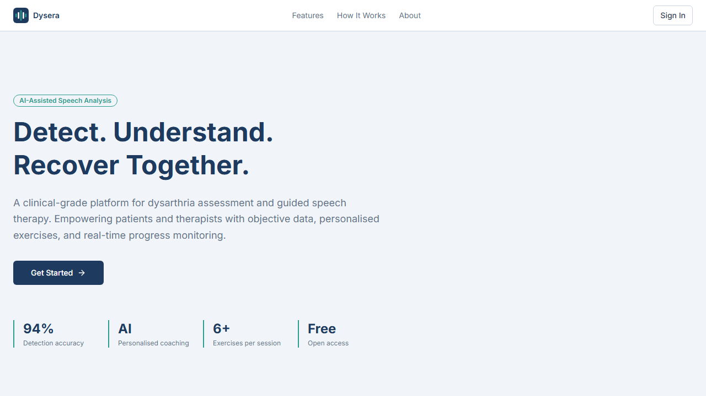
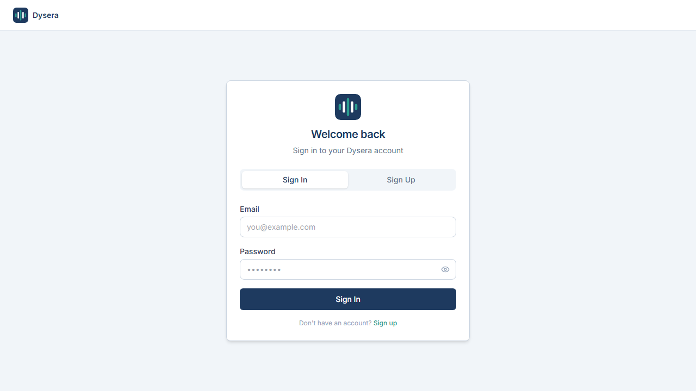
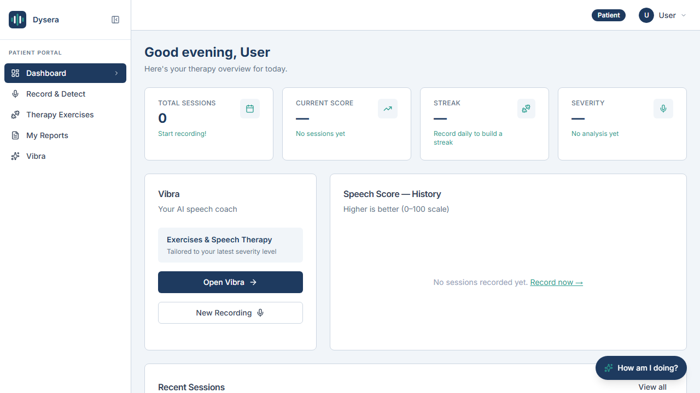
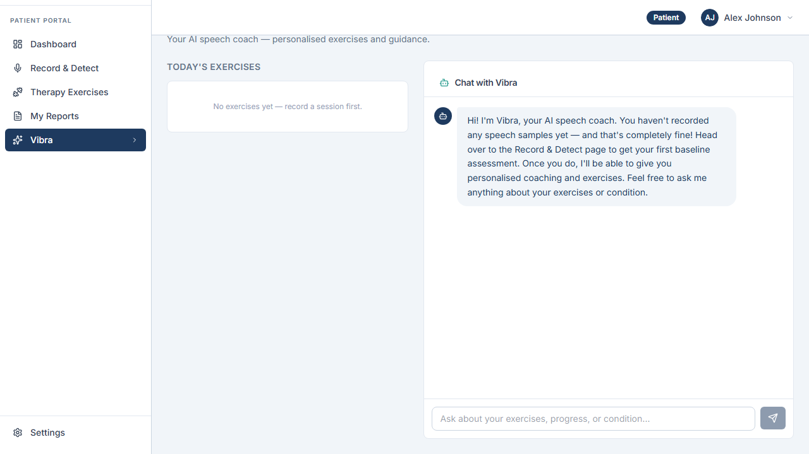
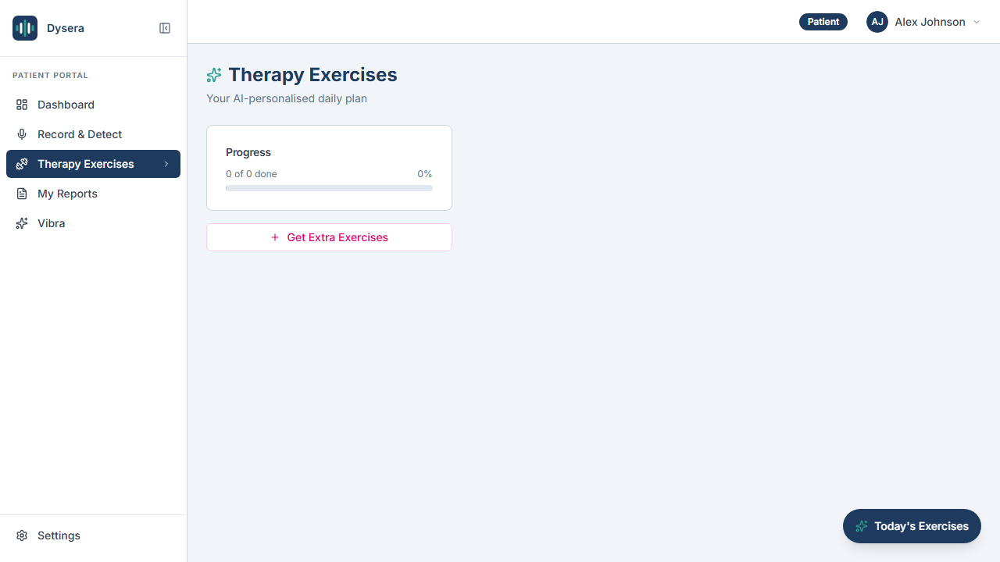
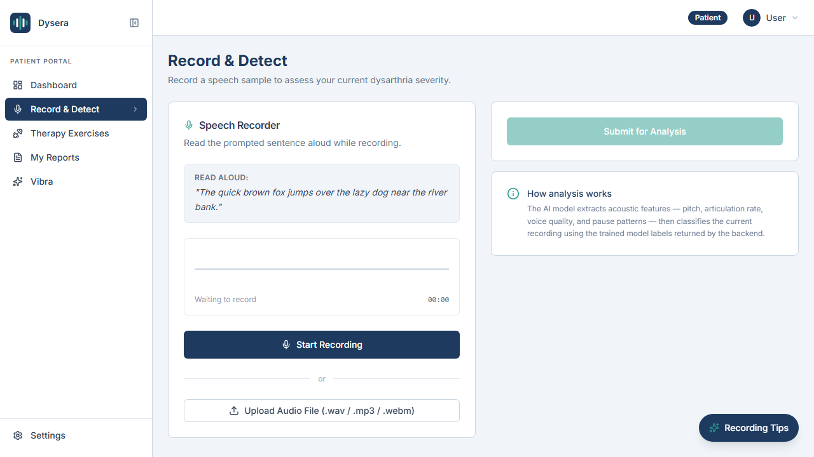
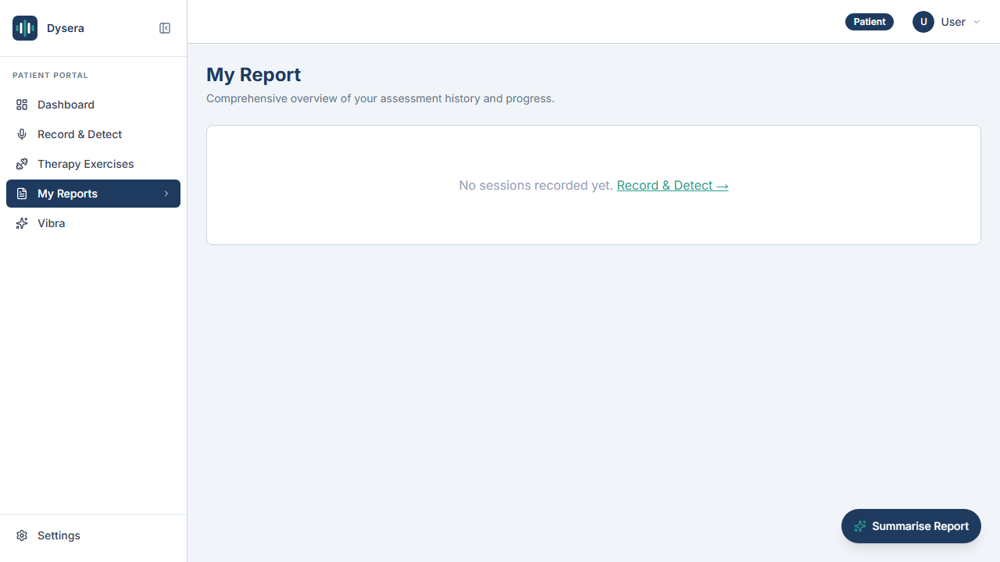
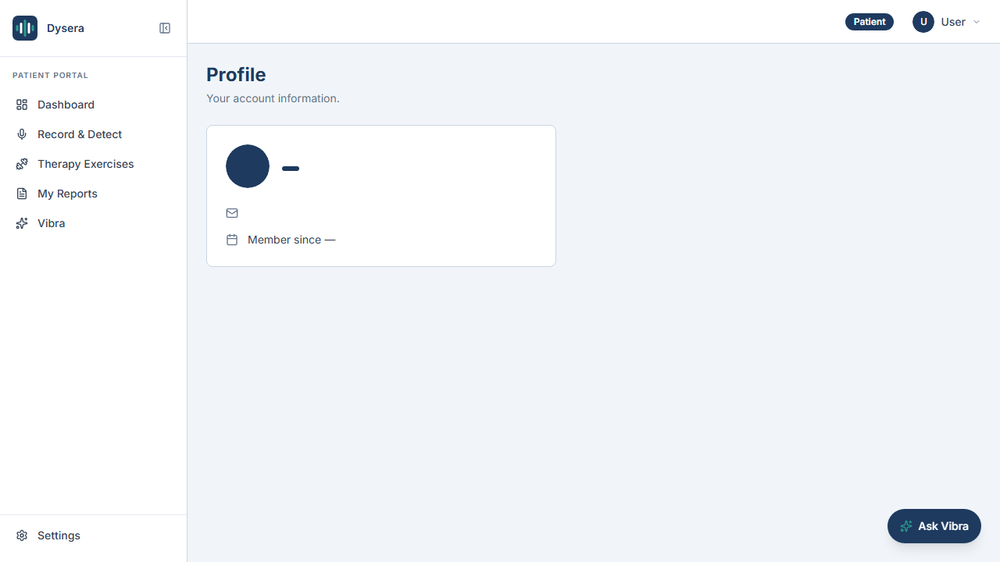
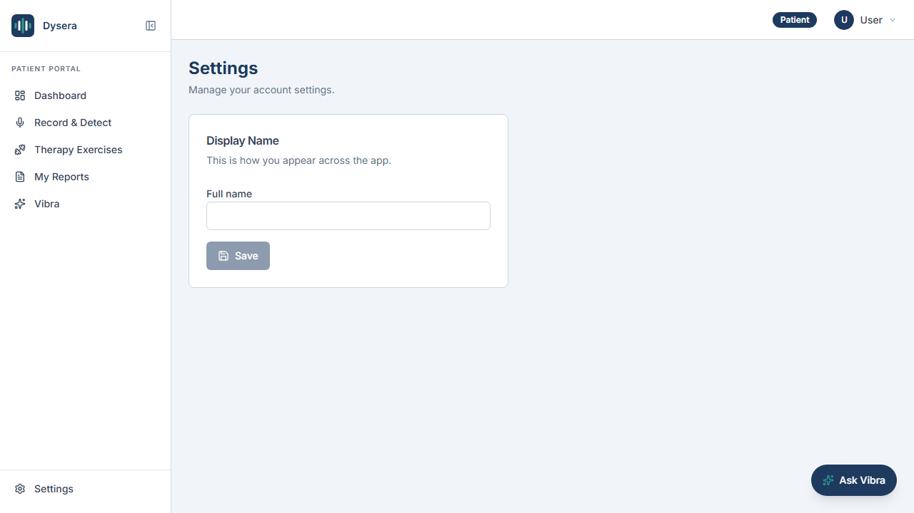

<div align="center">
  <br />
  <h1>🗣️ Dysera Speech Therapy</h1>
  <p><strong>AI-Powered Dysarthria Assessment & Speech Therapy Platform</strong></p>
</div>

<p align="center">
  
  
  
  
  
</p>

## 📖 Overview

Dysera is an AI-powered speech therapy platform specifically designed to aid in dysarthria assessment and therapy. Utilizing advanced machine learning workflows with FastAPI, Groq LLMs, and a React frontend, Dysera provides patients and therapists with real-time feedback, detailed reports, and personalized AI coaching.

---

## 🚀 Key Features

* **🎙️ Voice Assessment:** Real-time AI detection and analysis of dysarthric speech patterns.
* **🧠 AI Coaching:** Personalized feedback driven by Groq to help users correct their speech.
* **📊 Patient & Therapist Dashboards:** Comprehensive analytics, progress tracking, and session histories.
* **🔐 Secure Auth & Data:** Fully integrated with Supabase for robust user management, roles, and real-time data persistence.
* **⚡ Blazing Fast Backend:** Powered by FastAPI for swift processing of ML pipelines and model inference.

---

## 📸 Screenshots

| Landing Page | Login Page |
| :---: | :---: |
|  |  |

| Patient Dashboard | AI Coach |
| :---: | :---: |
|  |  |

| Therapy Exercise | Record & Detect |
| :---: | :---: |
|  |  |

| Patient Report | Profile & Settings |
| :---: | :---: |
|  | <br/> |

---

## 🛠️ Tech Stack

### Frontend
- **Framework:** React + Vite
- **Styling:** Tailwind CSS + Radix UI + Framer Motion
- **Routing:** React Router

### Backend & ML
- **Framework:** FastAPI (Python)
- **AI Models:** Groq API / Custom ML models
- **Database/Auth:** Supabase (PostgreSQL)

---

## 📁 Project Structure

```text
dysera-speech-therapy/
├── backend/                # FastAPI application, ML models, and API endpoints
├── public/                 # Static assets and screenshots
├── src/
│   ├── components/         # Reusable UI components
│   ├── lib/                # Context providers and utilities
│   ├── pages/              # Main application views and routes
│   ├── App.jsx             # React routing setup
│   └── main.jsx            # React entry point
└── package.json            # Frontend dependencies and dev scripts
```

---

## ⚙️ Setup and Installation

### Prerequisites
- Node.js & npm
- Python 3.8+
- Supabase Project & Groq API Key

### 1. Clone the Repository
```bash
git clone https://github.com/theadhithyankr/dysera-speech-therapy.git
cd dysera-speech-therapy
```

### 2. Install Dependencies
Install both the frontend and backend dependencies. (Assumes Python backend dependencies are listed in `backend/requirements.txt`)
```bash
# Frontend
npm install

# Backend
cd backend
pip install -r requirements.txt
```

### 3. Environment Variables
Create a `.env` file in the `backend/` directory:
```env
GROQ_API_KEY=your_groq_api_key
DATABASE_URL=your_supabase_postgresql_connection_string
SECRET_KEY=your_secret_key
```

### 4. Run the Development Server
Dysera comes with a `concurrently` script that starts both the Vite frontend and Uvicorn backend simultaneously.
```bash
npm run dev
```
- **Frontend:** http://localhost:5173
- **Backend API:** http://localhost:8000

---

## 🔗 Links
- **Repository:** [GitHub](https://github.com/theadhithyankr/dysera-speech-therapy)

<div align="center">
  <sub>Built with ❤️ for better speech therapy.</sub>
</div>
