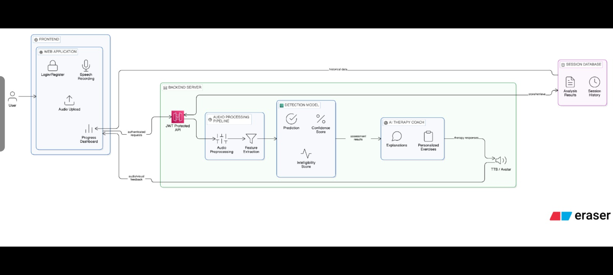

# Code Citations

## License: unknown
https://github.com/wybieracz/Web-Switching-Caching/blob/e3de482abddab07ccba32340f10db8ec162c9b8d/backend/Dockerfile

```
Here is the full, research-backed implementation plan:

---

## Dysarthria Platform — Full Implementation Plan

### Current State
The React skeleton is complete and running at `http://localhost:5173/`. All 6 pages, shadcn/ui components, Recharts charts, and role-based layout are done. Everything below is what gets built on top.

---

## Phase 1 — Real Audio Recording (Frontend) `Week 1`

**Goal:** Replace the fake waveform with real `MediaRecorder` API capture.

| Task | Detail |
|---|---|
| Browser audio capture | Use `navigator.mediaDevices.getUserMedia({ audio: true })` |
| Live waveform | `AnalyserNode` from Web Audio API → `requestAnimationFrame` canvas bars |
| File output | Record as `audio/webm` blob → convert to `.wav` using `audiobuffer-to-wav` or `lamejs` |
| Upload | Send as `FormData` multipart to backend |

**Library to add:**
```bash
npm install audiobuffer-to-wav
```

**Files to update:** [src/pages/RecordDetectPage.jsx](src/pages/RecordDetectPage.jsx) — replace the `Waveform` stub with real Web Audio API canvas renderer.

---

## Phase 2 — Python ML Backend `Weeks 1–3`

**Stack:** FastAPI + Uvicorn + Python 3.11

### 2a. Audio Feature Extraction (librosa)

Acoustic features proven in dysarthria research:

| Feature | Library | Clinical Relevance |
|---|---|---|
| MFCCs (13–40 coefficients) | `librosa.feature.mfcc` | Articulatory placement |
| Pitch (F0) + jitter | `librosa.piptrack` / `praat-parselmouth` | Phonatory control |
| HNR (Harmonics-to-Noise Ratio) | `parselmouth` | Voice quality |
| Articulation rate (syllables/sec) | VAD + energy | Motor speed |
| Pause ratio | `librosa.effects.split` | Respiratory support |
| Spectral centroid / rolloff | `librosa.feature.*` | Resonance / clarity |
| Zero-crossing rate | `librosa.feature.zero_crossing_rate` | Fricative quality |

```bash
pip install fastapi uvicorn python-multipart librosa praat-parselmouth torch transformers soundfile numpy scikit-learn
```

### 2b. Classification Model

Two viable approaches (both confirmed on HuggingFace):

**Option A — Fine-tune wav2vec2 (recommended)**
- Base: `facebook/wav2vec2-base` or `facebook/wav2vec2-xls-r-300m`
- Fine-tune on TORGO dataset (University of Toronto dysarthric speech corpus) or `birgermoell/dysarthria` on HuggingFace
- Output: 3-class label — `Mild / Moderate / Severe`
- WER as low as 17.6% achievable (per `jmaczan/wav2vec2-large-xls-r-300m-dysarthria`)

**Option B — Lightweight SVM/XGBoost on handcrafted features**
- Extract 40-dim MFCC + F0 stats + HNR → 80-dim feature vector
- Train `sklearn.svm.SVC` or `xgboost.XGBClassifier`
- Faster inference, good for MVP, ~85–90% accuracy on TORGO

**Datasets:**
- [TORGO Database](http://www.cs.toronto.edu/~frank/TORGO_database.html) — 7 dysarthric + 7 control speakers
- `birgermoell/dysarthria` on HuggingFace (400 downloads, annotated)
- `miosipof/Dysarthria_Synthetic` — 9k synthetic augmentation samples

### 2c. FastAPI Endpoint Structure

```
backend/
├── main.py                 # FastAPI app + CORS
├── routers/
│   ├── auth.py             # JWT login/register
│   ├── audio.py            # POST /analyze — upload + classify
│   ├── sessions.py         # GET/POST session history
│   ├── patients.py         # Therapist patient management
│   └── reports.py          # PDF/JSON report export
├── services/
│   ├── feature_extractor.py   # librosa pipeline
│   ├── classifier.py          # load model, run inference
│   └── report_generator.py    # ReportLab PDF
├── models/
│   ├── user.py             # SQLAlchemy ORM
│   ├── session.py
│   └── report.py
└── ml_models/
    └── dysarthria_clf.pkl  # saved sklearn model or HF checkpoint
```

Key endpoint:
```python
@router.post("/analyze")
async def analyze_audio(file: UploadFile, user=Depends(get_current_user)):
    audio_bytes = await file.read()
    features = extract_features(audio_bytes)       # librosa
    severity, score, breakdown = classify(features) # model
    session = save_session(user.id, severity, score)
    return {"severity": severity, "score": score, "features": breakdown, "session_id": session.id}
```

---

## Phase 3 — Database & Authentication `Week 2`

**Stack:** PostgreSQL + SQLAlchemy + Alembic + JWT (python-jose)

### Schema

```sql
users          (id, email, password_hash, role, name, created_at)
patients       (id, user_id FK, therapist_id FK, diagnosis, baseline_score)
sessions       (id, patient_id FK, recorded_at, severity, score, audio_path, features_json)
exercises      (id, patient_id FK, session_id FK, exercise_name, steps_completed, duration_sec)
therapist_notes(id, therapist_id FK, patient_id FK, note_text, created_at)
reports        (id, patient_id FK, generated_at, pdf_url)
```

### Auth Flow
- `POST /auth/register` → bcrypt hash, create user
- `POST /auth/login` → return JWT access token (30 min) + refresh token (7 days)
- Frontend stores token in `httpOnly` cookie or `localStorage` with XSS guard
- React Router guards: `<ProtectedRoute role="patient" />` and `<ProtectedRoute role="therapist" />`

---

## Phase 4 — Connect Frontend to Backend `Week 3`

| Frontend action | API call |
|---|---|
| Record & Submit button | `POST /api/analyze` with FormData |
| Patient Dashboard load | `GET /api/sessions/me?limit=10` |
| Progress chart | `GET /api/sessions/me/scores?weeks=8` |
| Therapist patient list | `GET /api/patients` |
| Save therapist note | `POST /api/notes` |
| Export PDF | `GET /api/reports/{patient_id}/pdf` |

Add **Axios** or **TanStack Query** for data fetching with loading/error states:
```bash
npm install axios @tanstack/react-query
```

---

## Phase 5 — Therapy Content & Gamification `Week 4`

| Feature | Implementation |
|---|---|
| Exercise database | JSON/DB table with 80+ exercises categorized by type |
| Adaptive programme | Rule-based engine: if `score < 50` → assign breath/phonation; if `50–70` → articulation rate |
| Streaks & badges | `gamification` table: `(patient_id, streak_days, badges[])` |
| Session timer | Frontend countdown with `useInterval` |
| Exercise recording | Record audio per exercise step → send to `/analyze/exercise` |

---

## Phase 6 — Deployment `Week 5`

**Architecture:**

```
[React SPA]  →  Vercel / Netlify (static hosting)
     ↓
[FastAPI]    →  Railway.app / Render.com / AWS EC2 (Docker)
     ↓
[PostgreSQL] →  Supabase (free tier) / AWS RDS / Railway Postgres
     ↓
[Audio Files]→  AWS S3 / Cloudflare R2 (presigned URLs)
[ML Model]   →  Hugging Face Inference API  OR  load on server
```

**Docker setup (backend):**
```dockerfile
FROM python:3.11-slim
WORKDIR /app
COPY requirements.txt .
RUN pip install -r requirements.txt
COPY . .
CMD ["uvicorn", "main:app", "--host", "0.0.0.0", "--port", "8000"]
```
```


## License: unknown
https://github.com/wybieracz/Web-Switching-Caching/blob/e3de482abddab07ccba32340f10db8ec162c9b8d/backend/Dockerfile

```
Here is the full, research-backed implementation plan:

---

## Dysarthria Platform — Full Implementation Plan

### Current State
The React skeleton is complete and running at `http://localhost:5173/`. All 6 pages, shadcn/ui components, Recharts charts, and role-based layout are done. Everything below is what gets built on top.

---

## Phase 1 — Real Audio Recording (Frontend) `Week 1`

**Goal:** Replace the fake waveform with real `MediaRecorder` API capture.

| Task | Detail |
|---|---|
| Browser audio capture | Use `navigator.mediaDevices.getUserMedia({ audio: true })` |
| Live waveform | `AnalyserNode` from Web Audio API → `requestAnimationFrame` canvas bars |
| File output | Record as `audio/webm` blob → convert to `.wav` using `audiobuffer-to-wav` or `lamejs` |
| Upload | Send as `FormData` multipart to backend |

**Library to add:**
```bash
npm install audiobuffer-to-wav
```

**Files to update:** [src/pages/RecordDetectPage.jsx](src/pages/RecordDetectPage.jsx) — replace the `Waveform` stub with real Web Audio API canvas renderer.

---

## Phase 2 — Python ML Backend `Weeks 1–3`

**Stack:** FastAPI + Uvicorn + Python 3.11

### 2a. Audio Feature Extraction (librosa)

Acoustic features proven in dysarthria research:

| Feature | Library | Clinical Relevance |
|---|---|---|
| MFCCs (13–40 coefficients) | `librosa.feature.mfcc` | Articulatory placement |
| Pitch (F0) + jitter | `librosa.piptrack` / `praat-parselmouth` | Phonatory control |
| HNR (Harmonics-to-Noise Ratio) | `parselmouth` | Voice quality |
| Articulation rate (syllables/sec) | VAD + energy | Motor speed |
| Pause ratio | `librosa.effects.split` | Respiratory support |
| Spectral centroid / rolloff | `librosa.feature.*` | Resonance / clarity |
| Zero-crossing rate | `librosa.feature.zero_crossing_rate` | Fricative quality |

```bash
pip install fastapi uvicorn python-multipart librosa praat-parselmouth torch transformers soundfile numpy scikit-learn
```

### 2b. Classification Model

Two viable approaches (both confirmed on HuggingFace):

**Option A — Fine-tune wav2vec2 (recommended)**
- Base: `facebook/wav2vec2-base` or `facebook/wav2vec2-xls-r-300m`
- Fine-tune on TORGO dataset (University of Toronto dysarthric speech corpus) or `birgermoell/dysarthria` on HuggingFace
- Output: 3-class label — `Mild / Moderate / Severe`
- WER as low as 17.6% achievable (per `jmaczan/wav2vec2-large-xls-r-300m-dysarthria`)

**Option B — Lightweight SVM/XGBoost on handcrafted features**
- Extract 40-dim MFCC + F0 stats + HNR → 80-dim feature vector
- Train `sklearn.svm.SVC` or `xgboost.XGBClassifier`
- Faster inference, good for MVP, ~85–90% accuracy on TORGO

**Datasets:**
- [TORGO Database](http://www.cs.toronto.edu/~frank/TORGO_database.html) — 7 dysarthric + 7 control speakers
- `birgermoell/dysarthria` on HuggingFace (400 downloads, annotated)
- `miosipof/Dysarthria_Synthetic` — 9k synthetic augmentation samples

### 2c. FastAPI Endpoint Structure

```
backend/
├── main.py                 # FastAPI app + CORS
├── routers/
│   ├── auth.py             # JWT login/register
│   ├── audio.py            # POST /analyze — upload + classify
│   ├── sessions.py         # GET/POST session history
│   ├── patients.py         # Therapist patient management
│   └── reports.py          # PDF/JSON report export
├── services/
│   ├── feature_extractor.py   # librosa pipeline
│   ├── classifier.py          # load model, run inference
│   └── report_generator.py    # ReportLab PDF
├── models/
│   ├── user.py             # SQLAlchemy ORM
│   ├── session.py
│   └── report.py
└── ml_models/
    └── dysarthria_clf.pkl  # saved sklearn model or HF checkpoint
```

Key endpoint:
```python
@router.post("/analyze")
async def analyze_audio(file: UploadFile, user=Depends(get_current_user)):
    audio_bytes = await file.read()
    features = extract_features(audio_bytes)       # librosa
    severity, score, breakdown = classify(features) # model
    session = save_session(user.id, severity, score)
    return {"severity": severity, "score": score, "features": breakdown, "session_id": session.id}
```

---

## Phase 3 — Database & Authentication `Week 2`

**Stack:** PostgreSQL + SQLAlchemy + Alembic + JWT (python-jose)

### Schema

```sql
users          (id, email, password_hash, role, name, created_at)
patients       (id, user_id FK, therapist_id FK, diagnosis, baseline_score)
sessions       (id, patient_id FK, recorded_at, severity, score, audio_path, features_json)
exercises      (id, patient_id FK, session_id FK, exercise_name, steps_completed, duration_sec)
therapist_notes(id, therapist_id FK, patient_id FK, note_text, created_at)
reports        (id, patient_id FK, generated_at, pdf_url)
```

### Auth Flow
- `POST /auth/register` → bcrypt hash, create user
- `POST /auth/login` → return JWT access token (30 min) + refresh token (7 days)
- Frontend stores token in `httpOnly` cookie or `localStorage` with XSS guard
- React Router guards: `<ProtectedRoute role="patient" />` and `<ProtectedRoute role="therapist" />`

---

## Phase 4 — Connect Frontend to Backend `Week 3`

| Frontend action | API call |
|---|---|
| Record & Submit button | `POST /api/analyze` with FormData |
| Patient Dashboard load | `GET /api/sessions/me?limit=10` |
| Progress chart | `GET /api/sessions/me/scores?weeks=8` |
| Therapist patient list | `GET /api/patients` |
| Save therapist note | `POST /api/notes` |
| Export PDF | `GET /api/reports/{patient_id}/pdf` |

Add **Axios** or **TanStack Query** for data fetching with loading/error states:
```bash
npm install axios @tanstack/react-query
```

---

## Phase 5 — Therapy Content & Gamification `Week 4`

| Feature | Implementation |
|---|---|
| Exercise database | JSON/DB table with 80+ exercises categorized by type |
| Adaptive programme | Rule-based engine: if `score < 50` → assign breath/phonation; if `50–70` → articulation rate |
| Streaks & badges | `gamification` table: `(patient_id, streak_days, badges[])` |
| Session timer | Frontend countdown with `useInterval` |
| Exercise recording | Record audio per exercise step → send to `/analyze/exercise` |

---

## Phase 6 — Deployment `Week 5`

**Architecture:**

```
[React SPA]  →  Vercel / Netlify (static hosting)
     ↓
[FastAPI]    →  Railway.app / Render.com / AWS EC2 (Docker)
     ↓
[PostgreSQL] →  Supabase (free tier) / AWS RDS / Railway Postgres
     ↓
[Audio Files]→  AWS S3 / Cloudflare R2 (presigned URLs)
[ML Model]   →  Hugging Face Inference API  OR  load on server
```

**Docker setup (backend):**
```dockerfile
FROM python:3.11-slim
WORKDIR /app
COPY requirements.txt .
RUN pip install -r requirements.txt
COPY . .
CMD ["uvicorn", "main:app", "--host", "0.0.0.0", "--port", "8000"]
```
```


## License: unknown
https://github.com/jrknox1977/knox.academy/blob/cecc5aea5ae8265d08fc7113d5bcac28e5c4ce7f/content/An_Exhustive_Guide_to_fastapi_for_beginners/02_Getting_Started_with_FastAPI.md

```
Here is the full, research-backed implementation plan:

---

## Dysarthria Platform — Full Implementation Plan

### Current State
The React skeleton is complete and running at `http://localhost:5173/`. All 6 pages, shadcn/ui components, Recharts charts, and role-based layout are done. Everything below is what gets built on top.

---

## Phase 1 — Real Audio Recording (Frontend) `Week 1`

**Goal:** Replace the fake waveform with real `MediaRecorder` API capture.

| Task | Detail |
|---|---|
| Browser audio capture | Use `navigator.mediaDevices.getUserMedia({ audio: true })` |
| Live waveform | `AnalyserNode` from Web Audio API → `requestAnimationFrame` canvas bars |
| File output | Record as `audio/webm` blob → convert to `.wav` using `audiobuffer-to-wav` or `lamejs` |
| Upload | Send as `FormData` multipart to backend |

**Library to add:**
```bash
npm install audiobuffer-to-wav
```

**Files to update:** [src/pages/RecordDetectPage.jsx](src/pages/RecordDetectPage.jsx) — replace the `Waveform` stub with real Web Audio API canvas renderer.

---

## Phase 2 — Python ML Backend `Weeks 1–3`

**Stack:** FastAPI + Uvicorn + Python 3.11

### 2a. Audio Feature Extraction (librosa)

Acoustic features proven in dysarthria research:

| Feature | Library | Clinical Relevance |
|---|---|---|
| MFCCs (13–40 coefficients) | `librosa.feature.mfcc` | Articulatory placement |
| Pitch (F0) + jitter | `librosa.piptrack` / `praat-parselmouth` | Phonatory control |
| HNR (Harmonics-to-Noise Ratio) | `parselmouth` | Voice quality |
| Articulation rate (syllables/sec) | VAD + energy | Motor speed |
| Pause ratio | `librosa.effects.split` | Respiratory support |
| Spectral centroid / rolloff | `librosa.feature.*` | Resonance / clarity |
| Zero-crossing rate | `librosa.feature.zero_crossing_rate` | Fricative quality |

```bash
pip install fastapi uvicorn python-multipart librosa praat-parselmouth torch transformers soundfile numpy scikit-learn
```

### 2b. Classification Model

Two viable approaches (both confirmed on HuggingFace):

**Option A — Fine-tune wav2vec2 (recommended)**
- Base: `facebook/wav2vec2-base` or `facebook/wav2vec2-xls-r-300m`
- Fine-tune on TORGO dataset (University of Toronto dysarthric speech corpus) or `birgermoell/dysarthria` on HuggingFace
- Output: 3-class label — `Mild / Moderate / Severe`
- WER as low as 17.6% achievable (per `jmaczan/wav2vec2-large-xls-r-300m-dysarthria`)

**Option B — Lightweight SVM/XGBoost on handcrafted features**
- Extract 40-dim MFCC + F0 stats + HNR → 80-dim feature vector
- Train `sklearn.svm.SVC` or `xgboost.XGBClassifier`
- Faster inference, good for MVP, ~85–90% accuracy on TORGO

**Datasets:**
- [TORGO Database](http://www.cs.toronto.edu/~frank/TORGO_database.html) — 7 dysarthric + 7 control speakers
- `birgermoell/dysarthria` on HuggingFace (400 downloads, annotated)
- `miosipof/Dysarthria_Synthetic` — 9k synthetic augmentation samples

### 2c. FastAPI Endpoint Structure

```
backend/
├── main.py                 # FastAPI app + CORS
├── routers/
│   ├── auth.py             # JWT login/register
│   ├── audio.py            # POST /analyze — upload + classify
│   ├── sessions.py         # GET/POST session history
│   ├── patients.py         # Therapist patient management
│   └── reports.py          # PDF/JSON report export
├── services/
│   ├── feature_extractor.py   # librosa pipeline
│   ├── classifier.py          # load model, run inference
│   └── report_generator.py    # ReportLab PDF
├── models/
│   ├── user.py             # SQLAlchemy ORM
│   ├── session.py
│   └── report.py
└── ml_models/
    └── dysarthria_clf.pkl  # saved sklearn model or HF checkpoint
```

Key endpoint:
```python
@router.post("/analyze")
async def analyze_audio(file: UploadFile, user=Depends(get_current_user)):
    audio_bytes = await file.read()
    features = extract_features(audio_bytes)       # librosa
    severity, score, breakdown = classify(features) # model
    session = save_session(user.id, severity, score)
    return {"severity": severity, "score": score, "features": breakdown, "session_id": session.id}
```

---

## Phase 3 — Database & Authentication `Week 2`

**Stack:** PostgreSQL + SQLAlchemy + Alembic + JWT (python-jose)

### Schema

```sql
users          (id, email, password_hash, role, name, created_at)
patients       (id, user_id FK, therapist_id FK, diagnosis, baseline_score)
sessions       (id, patient_id FK, recorded_at, severity, score, audio_path, features_json)
exercises      (id, patient_id FK, session_id FK, exercise_name, steps_completed, duration_sec)
therapist_notes(id, therapist_id FK, patient_id FK, note_text, created_at)
reports        (id, patient_id FK, generated_at, pdf_url)
```

### Auth Flow
- `POST /auth/register` → bcrypt hash, create user
- `POST /auth/login` → return JWT access token (30 min) + refresh token (7 days)
- Frontend stores token in `httpOnly` cookie or `localStorage` with XSS guard
- React Router guards: `<ProtectedRoute role="patient" />` and `<ProtectedRoute role="therapist" />`

---

## Phase 4 — Connect Frontend to Backend `Week 3`

| Frontend action | API call |
|---|---|
| Record & Submit button | `POST /api/analyze` with FormData |
| Patient Dashboard load | `GET /api/sessions/me?limit=10` |
| Progress chart | `GET /api/sessions/me/scores?weeks=8` |
| Therapist patient list | `GET /api/patients` |
| Save therapist note | `POST /api/notes` |
| Export PDF | `GET /api/reports/{patient_id}/pdf` |

Add **Axios** or **TanStack Query** for data fetching with loading/error states:
```bash
npm install axios @tanstack/react-query
```

---

## Phase 5 — Therapy Content & Gamification `Week 4`

| Feature | Implementation |
|---|---|
| Exercise database | JSON/DB table with 80+ exercises categorized by type |
| Adaptive programme | Rule-based engine: if `score < 50` → assign breath/phonation; if `50–70` → articulation rate |
| Streaks & badges | `gamification` table: `(patient_id, streak_days, badges[])` |
| Session timer | Frontend countdown with `useInterval` |
| Exercise recording | Record audio per exercise step → send to `/analyze/exercise` |

---

## Phase 6 — Deployment `Week 5`

**Architecture:**

```
[React SPA]  →  Vercel / Netlify (static hosting)
     ↓
[FastAPI]    →  Railway.app / Render.com / AWS EC2 (Docker)
     ↓
[PostgreSQL] →  Supabase (free tier) / AWS RDS / Railway Postgres
     ↓
[Audio Files]→  AWS S3 / Cloudflare R2 (presigned URLs)
[ML Model]   →  Hugging Face Inference API  OR  load on server
```

**Docker setup (backend):**
```dockerfile
FROM python:3.11-slim
WORKDIR /app
COPY requirements.txt .
RUN pip install -r requirements.txt
COPY . .
CMD ["uvicorn", "main:app", "--host", "0.0.0.0", "--port", "8000"]
```

---

##
```


## License: unknown
https://github.com/wybieracz/Web-Switching-Caching/blob/e3de482abddab07ccba32340f10db8ec162c9b8d/backend/Dockerfile

```
Here is the full, research-backed implementation plan:

---

## Dysarthria Platform — Full Implementation Plan

### Current State
The React skeleton is complete and running at `http://localhost:5173/`. All 6 pages, shadcn/ui components, Recharts charts, and role-based layout are done. Everything below is what gets built on top.

---

## Phase 1 — Real Audio Recording (Frontend) `Week 1`

**Goal:** Replace the fake waveform with real `MediaRecorder` API capture.

| Task | Detail |
|---|---|
| Browser audio capture | Use `navigator.mediaDevices.getUserMedia({ audio: true })` |
| Live waveform | `AnalyserNode` from Web Audio API → `requestAnimationFrame` canvas bars |
| File output | Record as `audio/webm` blob → convert to `.wav` using `audiobuffer-to-wav` or `lamejs` |
| Upload | Send as `FormData` multipart to backend |

**Library to add:**
```bash
npm install audiobuffer-to-wav
```

**Files to update:** [src/pages/RecordDetectPage.jsx](src/pages/RecordDetectPage.jsx) — replace the `Waveform` stub with real Web Audio API canvas renderer.

---

## Phase 2 — Python ML Backend `Weeks 1–3`

**Stack:** FastAPI + Uvicorn + Python 3.11

### 2a. Audio Feature Extraction (librosa)

Acoustic features proven in dysarthria research:

| Feature | Library | Clinical Relevance |
|---|---|---|
| MFCCs (13–40 coefficients) | `librosa.feature.mfcc` | Articulatory placement |
| Pitch (F0) + jitter | `librosa.piptrack` / `praat-parselmouth` | Phonatory control |
| HNR (Harmonics-to-Noise Ratio) | `parselmouth` | Voice quality |
| Articulation rate (syllables/sec) | VAD + energy | Motor speed |
| Pause ratio | `librosa.effects.split` | Respiratory support |
| Spectral centroid / rolloff | `librosa.feature.*` | Resonance / clarity |
| Zero-crossing rate | `librosa.feature.zero_crossing_rate` | Fricative quality |

```bash
pip install fastapi uvicorn python-multipart librosa praat-parselmouth torch transformers soundfile numpy scikit-learn
```

### 2b. Classification Model

Two viable approaches (both confirmed on HuggingFace):

**Option A — Fine-tune wav2vec2 (recommended)**
- Base: `facebook/wav2vec2-base` or `facebook/wav2vec2-xls-r-300m`
- Fine-tune on TORGO dataset (University of Toronto dysarthric speech corpus) or `birgermoell/dysarthria` on HuggingFace
- Output: 3-class label — `Mild / Moderate / Severe`
- WER as low as 17.6% achievable (per `jmaczan/wav2vec2-large-xls-r-300m-dysarthria`)

**Option B — Lightweight SVM/XGBoost on handcrafted features**
- Extract 40-dim MFCC + F0 stats + HNR → 80-dim feature vector
- Train `sklearn.svm.SVC` or `xgboost.XGBClassifier`
- Faster inference, good for MVP, ~85–90% accuracy on TORGO

**Datasets:**
- [TORGO Database](http://www.cs.toronto.edu/~frank/TORGO_database.html) — 7 dysarthric + 7 control speakers
- `birgermoell/dysarthria` on HuggingFace (400 downloads, annotated)
- `miosipof/Dysarthria_Synthetic` — 9k synthetic augmentation samples

### 2c. FastAPI Endpoint Structure

```
backend/
├── main.py                 # FastAPI app + CORS
├── routers/
│   ├── auth.py             # JWT login/register
│   ├── audio.py            # POST /analyze — upload + classify
│   ├── sessions.py         # GET/POST session history
│   ├── patients.py         # Therapist patient management
│   └── reports.py          # PDF/JSON report export
├── services/
│   ├── feature_extractor.py   # librosa pipeline
│   ├── classifier.py          # load model, run inference
│   └── report_generator.py    # ReportLab PDF
├── models/
│   ├── user.py             # SQLAlchemy ORM
│   ├── session.py
│   └── report.py
└── ml_models/
    └── dysarthria_clf.pkl  # saved sklearn model or HF checkpoint
```

Key endpoint:
```python
@router.post("/analyze")
async def analyze_audio(file: UploadFile, user=Depends(get_current_user)):
    audio_bytes = await file.read()
    features = extract_features(audio_bytes)       # librosa
    severity, score, breakdown = classify(features) # model
    session = save_session(user.id, severity, score)
    return {"severity": severity, "score": score, "features": breakdown, "session_id": session.id}
```

---

## Phase 3 — Database & Authentication `Week 2`

**Stack:** PostgreSQL + SQLAlchemy + Alembic + JWT (python-jose)

### Schema

```sql
users          (id, email, password_hash, role, name, created_at)
patients       (id, user_id FK, therapist_id FK, diagnosis, baseline_score)
sessions       (id, patient_id FK, recorded_at, severity, score, audio_path, features_json)
exercises      (id, patient_id FK, session_id FK, exercise_name, steps_completed, duration_sec)
therapist_notes(id, therapist_id FK, patient_id FK, note_text, created_at)
reports        (id, patient_id FK, generated_at, pdf_url)
```

### Auth Flow
- `POST /auth/register` → bcrypt hash, create user
- `POST /auth/login` → return JWT access token (30 min) + refresh token (7 days)
- Frontend stores token in `httpOnly` cookie or `localStorage` with XSS guard
- React Router guards: `<ProtectedRoute role="patient" />` and `<ProtectedRoute role="therapist" />`

---

## Phase 4 — Connect Frontend to Backend `Week 3`

| Frontend action | API call |
|---|---|
| Record & Submit button | `POST /api/analyze` with FormData |
| Patient Dashboard load | `GET /api/sessions/me?limit=10` |
| Progress chart | `GET /api/sessions/me/scores?weeks=8` |
| Therapist patient list | `GET /api/patients` |
| Save therapist note | `POST /api/notes` |
| Export PDF | `GET /api/reports/{patient_id}/pdf` |

Add **Axios** or **TanStack Query** for data fetching with loading/error states:
```bash
npm install axios @tanstack/react-query
```

---

## Phase 5 — Therapy Content & Gamification `Week 4`

| Feature | Implementation |
|---|---|
| Exercise database | JSON/DB table with 80+ exercises categorized by type |
| Adaptive programme | Rule-based engine: if `score < 50` → assign breath/phonation; if `50–70` → articulation rate |
| Streaks & badges | `gamification` table: `(patient_id, streak_days, badges[])` |
| Session timer | Frontend countdown with `useInterval` |
| Exercise recording | Record audio per exercise step → send to `/analyze/exercise` |

---

## Phase 6 — Deployment `Week 5`

**Architecture:**

```
[React SPA]  →  Vercel / Netlify (static hosting)
     ↓
[FastAPI]    →  Railway.app / Render.com / AWS EC2 (Docker)
     ↓
[PostgreSQL] →  Supabase (free tier) / AWS RDS / Railway Postgres
     ↓
[Audio Files]→  AWS S3 / Cloudflare R2 (presigned URLs)
[ML Model]   →  Hugging Face Inference API  OR  load on server
```

**Docker setup (backend):**
```dockerfile
FROM python:3.11-slim
WORKDIR /app
COPY requirements.txt .
RUN pip install -r requirements.txt
COPY . .
CMD ["uvicorn", "main:app", "--host", "0.0.0.0", "--port", "8000"]
```
```


## License: unknown
https://github.com/jrknox1977/knox.academy/blob/cecc5aea5ae8265d08fc7113d5bcac28e5c4ce7f/content/An_Exhustive_Guide_to_fastapi_for_beginners/02_Getting_Started_with_FastAPI.md

```
Here is the full, research-backed implementation plan:

---

## Dysarthria Platform — Full Implementation Plan

### Current State
The React skeleton is complete and running at `http://localhost:5173/`. All 6 pages, shadcn/ui components, Recharts charts, and role-based layout are done. Everything below is what gets built on top.

---

## Phase 1 — Real Audio Recording (Frontend) `Week 1`

**Goal:** Replace the fake waveform with real `MediaRecorder` API capture.

| Task | Detail |
|---|---|
| Browser audio capture | Use `navigator.mediaDevices.getUserMedia({ audio: true })` |
| Live waveform | `AnalyserNode` from Web Audio API → `requestAnimationFrame` canvas bars |
| File output | Record as `audio/webm` blob → convert to `.wav` using `audiobuffer-to-wav` or `lamejs` |
| Upload | Send as `FormData` multipart to backend |

**Library to add:**
```bash
npm install audiobuffer-to-wav
```

**Files to update:** [src/pages/RecordDetectPage.jsx](src/pages/RecordDetectPage.jsx) — replace the `Waveform` stub with real Web Audio API canvas renderer.

---

## Phase 2 — Python ML Backend `Weeks 1–3`

**Stack:** FastAPI + Uvicorn + Python 3.11

### 2a. Audio Feature Extraction (librosa)

Acoustic features proven in dysarthria research:

| Feature | Library | Clinical Relevance |
|---|---|---|
| MFCCs (13–40 coefficients) | `librosa.feature.mfcc` | Articulatory placement |
| Pitch (F0) + jitter | `librosa.piptrack` / `praat-parselmouth` | Phonatory control |
| HNR (Harmonics-to-Noise Ratio) | `parselmouth` | Voice quality |
| Articulation rate (syllables/sec) | VAD + energy | Motor speed |
| Pause ratio | `librosa.effects.split` | Respiratory support |
| Spectral centroid / rolloff | `librosa.feature.*` | Resonance / clarity |
| Zero-crossing rate | `librosa.feature.zero_crossing_rate` | Fricative quality |

```bash
pip install fastapi uvicorn python-multipart librosa praat-parselmouth torch transformers soundfile numpy scikit-learn
```

### 2b. Classification Model

Two viable approaches (both confirmed on HuggingFace):

**Option A — Fine-tune wav2vec2 (recommended)**
- Base: `facebook/wav2vec2-base` or `facebook/wav2vec2-xls-r-300m`
- Fine-tune on TORGO dataset (University of Toronto dysarthric speech corpus) or `birgermoell/dysarthria` on HuggingFace
- Output: 3-class label — `Mild / Moderate / Severe`
- WER as low as 17.6% achievable (per `jmaczan/wav2vec2-large-xls-r-300m-dysarthria`)

**Option B — Lightweight SVM/XGBoost on handcrafted features**
- Extract 40-dim MFCC + F0 stats + HNR → 80-dim feature vector
- Train `sklearn.svm.SVC` or `xgboost.XGBClassifier`
- Faster inference, good for MVP, ~85–90% accuracy on TORGO

**Datasets:**
- [TORGO Database](http://www.cs.toronto.edu/~frank/TORGO_database.html) — 7 dysarthric + 7 control speakers
- `birgermoell/dysarthria` on HuggingFace (400 downloads, annotated)
- `miosipof/Dysarthria_Synthetic` — 9k synthetic augmentation samples

### 2c. FastAPI Endpoint Structure

```
backend/
├── main.py                 # FastAPI app + CORS
├── routers/
│   ├── auth.py             # JWT login/register
│   ├── audio.py            # POST /analyze — upload + classify
│   ├── sessions.py         # GET/POST session history
│   ├── patients.py         # Therapist patient management
│   └── reports.py          # PDF/JSON report export
├── services/
│   ├── feature_extractor.py   # librosa pipeline
│   ├── classifier.py          # load model, run inference
│   └── report_generator.py    # ReportLab PDF
├── models/
│   ├── user.py             # SQLAlchemy ORM
│   ├── session.py
│   └── report.py
└── ml_models/
    └── dysarthria_clf.pkl  # saved sklearn model or HF checkpoint
```

Key endpoint:
```python
@router.post("/analyze")
async def analyze_audio(file: UploadFile, user=Depends(get_current_user)):
    audio_bytes = await file.read()
    features = extract_features(audio_bytes)       # librosa
    severity, score, breakdown = classify(features) # model
    session = save_session(user.id, severity, score)
    return {"severity": severity, "score": score, "features": breakdown, "session_id": session.id}
```

---

## Phase 3 — Database & Authentication `Week 2`

**Stack:** PostgreSQL + SQLAlchemy + Alembic + JWT (python-jose)

### Schema

```sql
users          (id, email, password_hash, role, name, created_at)
patients       (id, user_id FK, therapist_id FK, diagnosis, baseline_score)
sessions       (id, patient_id FK, recorded_at, severity, score, audio_path, features_json)
exercises      (id, patient_id FK, session_id FK, exercise_name, steps_completed, duration_sec)
therapist_notes(id, therapist_id FK, patient_id FK, note_text, created_at)
reports        (id, patient_id FK, generated_at, pdf_url)
```

### Auth Flow
- `POST /auth/register` → bcrypt hash, create user
- `POST /auth/login` → return JWT access token (30 min) + refresh token (7 days)
- Frontend stores token in `httpOnly` cookie or `localStorage` with XSS guard
- React Router guards: `<ProtectedRoute role="patient" />` and `<ProtectedRoute role="therapist" />`

---

## Phase 4 — Connect Frontend to Backend `Week 3`

| Frontend action | API call |
|---|---|
| Record & Submit button | `POST /api/analyze` with FormData |
| Patient Dashboard load | `GET /api/sessions/me?limit=10` |
| Progress chart | `GET /api/sessions/me/scores?weeks=8` |
| Therapist patient list | `GET /api/patients` |
| Save therapist note | `POST /api/notes` |
| Export PDF | `GET /api/reports/{patient_id}/pdf` |

Add **Axios** or **TanStack Query** for data fetching with loading/error states:
```bash
npm install axios @tanstack/react-query
```

---

## Phase 5 — Therapy Content & Gamification `Week 4`

| Feature | Implementation |
|---|---|
| Exercise database | JSON/DB table with 80+ exercises categorized by type |
| Adaptive programme | Rule-based engine: if `score < 50` → assign breath/phonation; if `50–70` → articulation rate |
| Streaks & badges | `gamification` table: `(patient_id, streak_days, badges[])` |
| Session timer | Frontend countdown with `useInterval` |
| Exercise recording | Record audio per exercise step → send to `/analyze/exercise` |

---

## Phase 6 — Deployment `Week 5`

**Architecture:**

```
[React SPA]  →  Vercel / Netlify (static hosting)
     ↓
[FastAPI]    →  Railway.app / Render.com / AWS EC2 (Docker)
     ↓
[PostgreSQL] →  Supabase (free tier) / AWS RDS / Railway Postgres
     ↓
[Audio Files]→  AWS S3 / Cloudflare R2 (presigned URLs)
[ML Model]   →  Hugging Face Inference API  OR  load on server
```

**Docker setup (backend):**
```dockerfile
FROM python:3.11-slim
WORKDIR /app
COPY requirements.txt .
RUN pip install -r requirements.txt
COPY . .
CMD ["uvicorn", "main:app", "--host", "0.0.0.0", "--port", "8000"]
```

---

##
```


## License: unknown
https://github.com/wybieracz/Web-Switching-Caching/blob/e3de482abddab07ccba32340f10db8ec162c9b8d/backend/Dockerfile

```
Here is the full, research-backed implementation plan:

---

## Dysarthria Platform — Full Implementation Plan

### Current State
The React skeleton is complete and running at `http://localhost:5173/`. All 6 pages, shadcn/ui components, Recharts charts, and role-based layout are done. Everything below is what gets built on top.

---

## Phase 1 — Real Audio Recording (Frontend) `Week 1`

**Goal:** Replace the fake waveform with real `MediaRecorder` API capture.

| Task | Detail |
|---|---|
| Browser audio capture | Use `navigator.mediaDevices.getUserMedia({ audio: true })` |
| Live waveform | `AnalyserNode` from Web Audio API → `requestAnimationFrame` canvas bars |
| File output | Record as `audio/webm` blob → convert to `.wav` using `audiobuffer-to-wav` or `lamejs` |
| Upload | Send as `FormData` multipart to backend |

**Library to add:**
```bash
npm install audiobuffer-to-wav
```

**Files to update:** [src/pages/RecordDetectPage.jsx](src/pages/RecordDetectPage.jsx) — replace the `Waveform` stub with real Web Audio API canvas renderer.

---

## Phase 2 — Python ML Backend `Weeks 1–3`

**Stack:** FastAPI + Uvicorn + Python 3.11

### 2a. Audio Feature Extraction (librosa)

Acoustic features proven in dysarthria research:

| Feature | Library | Clinical Relevance |
|---|---|---|
| MFCCs (13–40 coefficients) | `librosa.feature.mfcc` | Articulatory placement |
| Pitch (F0) + jitter | `librosa.piptrack` / `praat-parselmouth` | Phonatory control |
| HNR (Harmonics-to-Noise Ratio) | `parselmouth` | Voice quality |
| Articulation rate (syllables/sec) | VAD + energy | Motor speed |
| Pause ratio | `librosa.effects.split` | Respiratory support |
| Spectral centroid / rolloff | `librosa.feature.*` | Resonance / clarity |
| Zero-crossing rate | `librosa.feature.zero_crossing_rate` | Fricative quality |

```bash
pip install fastapi uvicorn python-multipart librosa praat-parselmouth torch transformers soundfile numpy scikit-learn
```

### 2b. Classification Model

Two viable approaches (both confirmed on HuggingFace):

**Option A — Fine-tune wav2vec2 (recommended)**
- Base: `facebook/wav2vec2-base` or `facebook/wav2vec2-xls-r-300m`
- Fine-tune on TORGO dataset (University of Toronto dysarthric speech corpus) or `birgermoell/dysarthria` on HuggingFace
- Output: 3-class label — `Mild / Moderate / Severe`
- WER as low as 17.6% achievable (per `jmaczan/wav2vec2-large-xls-r-300m-dysarthria`)

**Option B — Lightweight SVM/XGBoost on handcrafted features**
- Extract 40-dim MFCC + F0 stats + HNR → 80-dim feature vector
- Train `sklearn.svm.SVC` or `xgboost.XGBClassifier`
- Faster inference, good for MVP, ~85–90% accuracy on TORGO

**Datasets:**
- [TORGO Database](http://www.cs.toronto.edu/~frank/TORGO_database.html) — 7 dysarthric + 7 control speakers
- `birgermoell/dysarthria` on HuggingFace (400 downloads, annotated)
- `miosipof/Dysarthria_Synthetic` — 9k synthetic augmentation samples

### 2c. FastAPI Endpoint Structure

```
backend/
├── main.py                 # FastAPI app + CORS
├── routers/
│   ├── auth.py             # JWT login/register
│   ├── audio.py            # POST /analyze — upload + classify
│   ├── sessions.py         # GET/POST session history
│   ├── patients.py         # Therapist patient management
│   └── reports.py          # PDF/JSON report export
├── services/
│   ├── feature_extractor.py   # librosa pipeline
│   ├── classifier.py          # load model, run inference
│   └── report_generator.py    # ReportLab PDF
├── models/
│   ├── user.py             # SQLAlchemy ORM
│   ├── session.py
│   └── report.py
└── ml_models/
    └── dysarthria_clf.pkl  # saved sklearn model or HF checkpoint
```

Key endpoint:
```python
@router.post("/analyze")
async def analyze_audio(file: UploadFile, user=Depends(get_current_user)):
    audio_bytes = await file.read()
    features = extract_features(audio_bytes)       # librosa
    severity, score, breakdown = classify(features) # model
    session = save_session(user.id, severity, score)
    return {"severity": severity, "score": score, "features": breakdown, "session_id": session.id}
```

---

## Phase 3 — Database & Authentication `Week 2`

**Stack:** PostgreSQL + SQLAlchemy + Alembic + JWT (python-jose)

### Schema

```sql
users          (id, email, password_hash, role, name, created_at)
patients       (id, user_id FK, therapist_id FK, diagnosis, baseline_score)
sessions       (id, patient_id FK, recorded_at, severity, score, audio_path, features_json)
exercises      (id, patient_id FK, session_id FK, exercise_name, steps_completed, duration_sec)
therapist_notes(id, therapist_id FK, patient_id FK, note_text, created_at)
reports        (id, patient_id FK, generated_at, pdf_url)
```

### Auth Flow
- `POST /auth/register` → bcrypt hash, create user
- `POST /auth/login` → return JWT access token (30 min) + refresh token (7 days)
- Frontend stores token in `httpOnly` cookie or `localStorage` with XSS guard
- React Router guards: `<ProtectedRoute role="patient" />` and `<ProtectedRoute role="therapist" />`

---

## Phase 4 — Connect Frontend to Backend `Week 3`

| Frontend action | API call |
|---|---|
| Record & Submit button | `POST /api/analyze` with FormData |
| Patient Dashboard load | `GET /api/sessions/me?limit=10` |
| Progress chart | `GET /api/sessions/me/scores?weeks=8` |
| Therapist patient list | `GET /api/patients` |
| Save therapist note | `POST /api/notes` |
| Export PDF | `GET /api/reports/{patient_id}/pdf` |

Add **Axios** or **TanStack Query** for data fetching with loading/error states:
```bash
npm install axios @tanstack/react-query
```

---

## Phase 5 — Therapy Content & Gamification `Week 4`

| Feature | Implementation |
|---|---|
| Exercise database | JSON/DB table with 80+ exercises categorized by type |
| Adaptive programme | Rule-based engine: if `score < 50` → assign breath/phonation; if `50–70` → articulation rate |
| Streaks & badges | `gamification` table: `(patient_id, streak_days, badges[])` |
| Session timer | Frontend countdown with `useInterval` |
| Exercise recording | Record audio per exercise step → send to `/analyze/exercise` |

---

## Phase 6 — Deployment `Week 5`

**Architecture:**

```
[React SPA]  →  Vercel / Netlify (static hosting)
     ↓
[FastAPI]    →  Railway.app / Render.com / AWS EC2 (Docker)
     ↓
[PostgreSQL] →  Supabase (free tier) / AWS RDS / Railway Postgres
     ↓
[Audio Files]→  AWS S3 / Cloudflare R2 (presigned URLs)
[ML Model]   →  Hugging Face Inference API  OR  load on server
```

**Docker setup (backend):**
```dockerfile
FROM python:3.11-slim
WORKDIR /app
COPY requirements.txt .
RUN pip install -r requirements.txt
COPY . .
CMD ["uvicorn", "main:app", "--host", "0.0.0.0", "--port", "8000"]
```
```


## License: unknown
https://github.com/jrknox1977/knox.academy/blob/cecc5aea5ae8265d08fc7113d5bcac28e5c4ce7f/content/An_Exhustive_Guide_to_fastapi_for_beginners/02_Getting_Started_with_FastAPI.md

```
Here is the full, research-backed implementation plan:

---

## Dysarthria Platform — Full Implementation Plan

### Current State
The React skeleton is complete and running at `http://localhost:5173/`. All 6 pages, shadcn/ui components, Recharts charts, and role-based layout are done. Everything below is what gets built on top.

---

## Phase 1 — Real Audio Recording (Frontend) `Week 1`

**Goal:** Replace the fake waveform with real `MediaRecorder` API capture.

| Task | Detail |
|---|---|
| Browser audio capture | Use `navigator.mediaDevices.getUserMedia({ audio: true })` |
| Live waveform | `AnalyserNode` from Web Audio API → `requestAnimationFrame` canvas bars |
| File output | Record as `audio/webm` blob → convert to `.wav` using `audiobuffer-to-wav` or `lamejs` |
| Upload | Send as `FormData` multipart to backend |

**Library to add:**
```bash
npm install audiobuffer-to-wav
```

**Files to update:** [src/pages/RecordDetectPage.jsx](src/pages/RecordDetectPage.jsx) — replace the `Waveform` stub with real Web Audio API canvas renderer.

---

## Phase 2 — Python ML Backend `Weeks 1–3`

**Stack:** FastAPI + Uvicorn + Python 3.11

### 2a. Audio Feature Extraction (librosa)

Acoustic features proven in dysarthria research:

| Feature | Library | Clinical Relevance |
|---|---|---|
| MFCCs (13–40 coefficients) | `librosa.feature.mfcc` | Articulatory placement |
| Pitch (F0) + jitter | `librosa.piptrack` / `praat-parselmouth` | Phonatory control |
| HNR (Harmonics-to-Noise Ratio) | `parselmouth` | Voice quality |
| Articulation rate (syllables/sec) | VAD + energy | Motor speed |
| Pause ratio | `librosa.effects.split` | Respiratory support |
| Spectral centroid / rolloff | `librosa.feature.*` | Resonance / clarity |
| Zero-crossing rate | `librosa.feature.zero_crossing_rate` | Fricative quality |

```bash
pip install fastapi uvicorn python-multipart librosa praat-parselmouth torch transformers soundfile numpy scikit-learn
```

### 2b. Classification Model

Two viable approaches (both confirmed on HuggingFace):

**Option A — Fine-tune wav2vec2 (recommended)**
- Base: `facebook/wav2vec2-base` or `facebook/wav2vec2-xls-r-300m`
- Fine-tune on TORGO dataset (University of Toronto dysarthric speech corpus) or `birgermoell/dysarthria` on HuggingFace
- Output: 3-class label — `Mild / Moderate / Severe`
- WER as low as 17.6% achievable (per `jmaczan/wav2vec2-large-xls-r-300m-dysarthria`)

**Option B — Lightweight SVM/XGBoost on handcrafted features**
- Extract 40-dim MFCC + F0 stats + HNR → 80-dim feature vector
- Train `sklearn.svm.SVC` or `xgboost.XGBClassifier`
- Faster inference, good for MVP, ~85–90% accuracy on TORGO

**Datasets:**
- [TORGO Database](http://www.cs.toronto.edu/~frank/TORGO_database.html) — 7 dysarthric + 7 control speakers
- `birgermoell/dysarthria` on HuggingFace (400 downloads, annotated)
- `miosipof/Dysarthria_Synthetic` — 9k synthetic augmentation samples

### 2c. FastAPI Endpoint Structure

```
backend/
├── main.py                 # FastAPI app + CORS
├── routers/
│   ├── auth.py             # JWT login/register
│   ├── audio.py            # POST /analyze — upload + classify
│   ├── sessions.py         # GET/POST session history
│   ├── patients.py         # Therapist patient management
│   └── reports.py          # PDF/JSON report export
├── services/
│   ├── feature_extractor.py   # librosa pipeline
│   ├── classifier.py          # load model, run inference
│   └── report_generator.py    # ReportLab PDF
├── models/
│   ├── user.py             # SQLAlchemy ORM
│   ├── session.py
│   └── report.py
└── ml_models/
    └── dysarthria_clf.pkl  # saved sklearn model or HF checkpoint
```

Key endpoint:
```python
@router.post("/analyze")
async def analyze_audio(file: UploadFile, user=Depends(get_current_user)):
    audio_bytes = await file.read()
    features = extract_features(audio_bytes)       # librosa
    severity, score, breakdown = classify(features) # model
    session = save_session(user.id, severity, score)
    return {"severity": severity, "score": score, "features": breakdown, "session_id": session.id}
```

---

## Phase 3 — Database & Authentication `Week 2`

**Stack:** PostgreSQL + SQLAlchemy + Alembic + JWT (python-jose)

### Schema

```sql
users          (id, email, password_hash, role, name, created_at)
patients       (id, user_id FK, therapist_id FK, diagnosis, baseline_score)
sessions       (id, patient_id FK, recorded_at, severity, score, audio_path, features_json)
exercises      (id, patient_id FK, session_id FK, exercise_name, steps_completed, duration_sec)
therapist_notes(id, therapist_id FK, patient_id FK, note_text, created_at)
reports        (id, patient_id FK, generated_at, pdf_url)
```

### Auth Flow
- `POST /auth/register` → bcrypt hash, create user
- `POST /auth/login` → return JWT access token (30 min) + refresh token (7 days)
- Frontend stores token in `httpOnly` cookie or `localStorage` with XSS guard
- React Router guards: `<ProtectedRoute role="patient" />` and `<ProtectedRoute role="therapist" />`

---

## Phase 4 — Connect Frontend to Backend `Week 3`

| Frontend action | API call |
|---|---|
| Record & Submit button | `POST /api/analyze` with FormData |
| Patient Dashboard load | `GET /api/sessions/me?limit=10` |
| Progress chart | `GET /api/sessions/me/scores?weeks=8` |
| Therapist patient list | `GET /api/patients` |
| Save therapist note | `POST /api/notes` |
| Export PDF | `GET /api/reports/{patient_id}/pdf` |

Add **Axios** or **TanStack Query** for data fetching with loading/error states:
```bash
npm install axios @tanstack/react-query
```

---

## Phase 5 — Therapy Content & Gamification `Week 4`

| Feature | Implementation |
|---|---|
| Exercise database | JSON/DB table with 80+ exercises categorized by type |
| Adaptive programme | Rule-based engine: if `score < 50` → assign breath/phonation; if `50–70` → articulation rate |
| Streaks & badges | `gamification` table: `(patient_id, streak_days, badges[])` |
| Session timer | Frontend countdown with `useInterval` |
| Exercise recording | Record audio per exercise step → send to `/analyze/exercise` |

---

## Phase 6 — Deployment `Week 5`

**Architecture:**

```
[React SPA]  →  Vercel / Netlify (static hosting)
     ↓
[FastAPI]    →  Railway.app / Render.com / AWS EC2 (Docker)
     ↓
[PostgreSQL] →  Supabase (free tier) / AWS RDS / Railway Postgres
     ↓
[Audio Files]→  AWS S3 / Cloudflare R2 (presigned URLs)
[ML Model]   →  Hugging Face Inference API  OR  load on server
```

**Docker setup (backend):**
```dockerfile
FROM python:3.11-slim
WORKDIR /app
COPY requirements.txt .
RUN pip install -r requirements.txt
COPY . .
CMD ["uvicorn", "main:app", "--host", "0.0.0.0", "--port", "8000"]
```

---

##
```


## License: unknown
https://github.com/wybieracz/Web-Switching-Caching/blob/e3de482abddab07ccba32340f10db8ec162c9b8d/backend/Dockerfile

```
Here is the full, research-backed implementation plan:

---

## Dysarthria Platform — Full Implementation Plan

### Current State
The React skeleton is complete and running at `http://localhost:5173/`. All 6 pages, shadcn/ui components, Recharts charts, and role-based layout are done. Everything below is what gets built on top.

---

## Phase 1 — Real Audio Recording (Frontend) `Week 1`

**Goal:** Replace the fake waveform with real `MediaRecorder` API capture.

| Task | Detail |
|---|---|
| Browser audio capture | Use `navigator.mediaDevices.getUserMedia({ audio: true })` |
| Live waveform | `AnalyserNode` from Web Audio API → `requestAnimationFrame` canvas bars |
| File output | Record as `audio/webm` blob → convert to `.wav` using `audiobuffer-to-wav` or `lamejs` |
| Upload | Send as `FormData` multipart to backend |

**Library to add:**
```bash
npm install audiobuffer-to-wav
```

**Files to update:** [src/pages/RecordDetectPage.jsx](src/pages/RecordDetectPage.jsx) — replace the `Waveform` stub with real Web Audio API canvas renderer.

---

## Phase 2 — Python ML Backend `Weeks 1–3`

**Stack:** FastAPI + Uvicorn + Python 3.11

### 2a. Audio Feature Extraction (librosa)

Acoustic features proven in dysarthria research:

| Feature | Library | Clinical Relevance |
|---|---|---|
| MFCCs (13–40 coefficients) | `librosa.feature.mfcc` | Articulatory placement |
| Pitch (F0) + jitter | `librosa.piptrack` / `praat-parselmouth` | Phonatory control |
| HNR (Harmonics-to-Noise Ratio) | `parselmouth` | Voice quality |
| Articulation rate (syllables/sec) | VAD + energy | Motor speed |
| Pause ratio | `librosa.effects.split` | Respiratory support |
| Spectral centroid / rolloff | `librosa.feature.*` | Resonance / clarity |
| Zero-crossing rate | `librosa.feature.zero_crossing_rate` | Fricative quality |

```bash
pip install fastapi uvicorn python-multipart librosa praat-parselmouth torch transformers soundfile numpy scikit-learn
```

### 2b. Classification Model

Two viable approaches (both confirmed on HuggingFace):

**Option A — Fine-tune wav2vec2 (recommended)**
- Base: `facebook/wav2vec2-base` or `facebook/wav2vec2-xls-r-300m`
- Fine-tune on TORGO dataset (University of Toronto dysarthric speech corpus) or `birgermoell/dysarthria` on HuggingFace
- Output: 3-class label — `Mild / Moderate / Severe`
- WER as low as 17.6% achievable (per `jmaczan/wav2vec2-large-xls-r-300m-dysarthria`)

**Option B — Lightweight SVM/XGBoost on handcrafted features**
- Extract 40-dim MFCC + F0 stats + HNR → 80-dim feature vector
- Train `sklearn.svm.SVC` or `xgboost.XGBClassifier`
- Faster inference, good for MVP, ~85–90% accuracy on TORGO

**Datasets:**
- [TORGO Database](http://www.cs.toronto.edu/~frank/TORGO_database.html) — 7 dysarthric + 7 control speakers
- `birgermoell/dysarthria` on HuggingFace (400 downloads, annotated)
- `miosipof/Dysarthria_Synthetic` — 9k synthetic augmentation samples

### 2c. FastAPI Endpoint Structure

```
backend/
├── main.py                 # FastAPI app + CORS
├── routers/
│   ├── auth.py             # JWT login/register
│   ├── audio.py            # POST /analyze — upload + classify
│   ├── sessions.py         # GET/POST session history
│   ├── patients.py         # Therapist patient management
│   └── reports.py          # PDF/JSON report export
├── services/
│   ├── feature_extractor.py   # librosa pipeline
│   ├── classifier.py          # load model, run inference
│   └── report_generator.py    # ReportLab PDF
├── models/
│   ├── user.py             # SQLAlchemy ORM
│   ├── session.py
│   └── report.py
└── ml_models/
    └── dysarthria_clf.pkl  # saved sklearn model or HF checkpoint
```

Key endpoint:
```python
@router.post("/analyze")
async def analyze_audio(file: UploadFile, user=Depends(get_current_user)):
    audio_bytes = await file.read()
    features = extract_features(audio_bytes)       # librosa
    severity, score, breakdown = classify(features) # model
    session = save_session(user.id, severity, score)
    return {"severity": severity, "score": score, "features": breakdown, "session_id": session.id}
```

---

## Phase 3 — Database & Authentication `Week 2`

**Stack:** PostgreSQL + SQLAlchemy + Alembic + JWT (python-jose)

### Schema

```sql
users          (id, email, password_hash, role, name, created_at)
patients       (id, user_id FK, therapist_id FK, diagnosis, baseline_score)
sessions       (id, patient_id FK, recorded_at, severity, score, audio_path, features_json)
exercises      (id, patient_id FK, session_id FK, exercise_name, steps_completed, duration_sec)
therapist_notes(id, therapist_id FK, patient_id FK, note_text, created_at)
reports        (id, patient_id FK, generated_at, pdf_url)
```

### Auth Flow
- `POST /auth/register` → bcrypt hash, create user
- `POST /auth/login` → return JWT access token (30 min) + refresh token (7 days)
- Frontend stores token in `httpOnly` cookie or `localStorage` with XSS guard
- React Router guards: `<ProtectedRoute role="patient" />` and `<ProtectedRoute role="therapist" />`

---

## Phase 4 — Connect Frontend to Backend `Week 3`

| Frontend action | API call |
|---|---|
| Record & Submit button | `POST /api/analyze` with FormData |
| Patient Dashboard load | `GET /api/sessions/me?limit=10` |
| Progress chart | `GET /api/sessions/me/scores?weeks=8` |
| Therapist patient list | `GET /api/patients` |
| Save therapist note | `POST /api/notes` |
| Export PDF | `GET /api/reports/{patient_id}/pdf` |

Add **Axios** or **TanStack Query** for data fetching with loading/error states:
```bash
npm install axios @tanstack/react-query
```

---

## Phase 5 — Therapy Content & Gamification `Week 4`

| Feature | Implementation |
|---|---|
| Exercise database | JSON/DB table with 80+ exercises categorized by type |
| Adaptive programme | Rule-based engine: if `score < 50` → assign breath/phonation; if `50–70` → articulation rate |
| Streaks & badges | `gamification` table: `(patient_id, streak_days, badges[])` |
| Session timer | Frontend countdown with `useInterval` |
| Exercise recording | Record audio per exercise step → send to `/analyze/exercise` |

---

## Phase 6 — Deployment `Week 5`

**Architecture:**

```
[React SPA]  →  Vercel / Netlify (static hosting)
     ↓
[FastAPI]    →  Railway.app / Render.com / AWS EC2 (Docker)
     ↓
[PostgreSQL] →  Supabase (free tier) / AWS RDS / Railway Postgres
     ↓
[Audio Files]→  AWS S3 / Cloudflare R2 (presigned URLs)
[ML Model]   →  Hugging Face Inference API  OR  load on server
```

**Docker setup (backend):**
```dockerfile
FROM python:3.11-slim
WORKDIR /app
COPY requirements.txt .
RUN pip install -r requirements.txt
COPY . .
CMD ["uvicorn", "main:app", "--host", "0.0.0.0", "--port", "8000"]
```
```


## License: unknown
https://github.com/jrknox1977/knox.academy/blob/cecc5aea5ae8265d08fc7113d5bcac28e5c4ce7f/content/An_Exhustive_Guide_to_fastapi_for_beginners/02_Getting_Started_with_FastAPI.md

```
Here is the full, research-backed implementation plan:

---

## Dysarthria Platform — Full Implementation Plan

### Current State
The React skeleton is complete and running at `http://localhost:5173/`. All 6 pages, shadcn/ui components, Recharts charts, and role-based layout are done. Everything below is what gets built on top.

---

## Phase 1 — Real Audio Recording (Frontend) `Week 1`

**Goal:** Replace the fake waveform with real `MediaRecorder` API capture.

| Task | Detail |
|---|---|
| Browser audio capture | Use `navigator.mediaDevices.getUserMedia({ audio: true })` |
| Live waveform | `AnalyserNode` from Web Audio API → `requestAnimationFrame` canvas bars |
| File output | Record as `audio/webm` blob → convert to `.wav` using `audiobuffer-to-wav` or `lamejs` |
| Upload | Send as `FormData` multipart to backend |

**Library to add:**
```bash
npm install audiobuffer-to-wav
```

**Files to update:** [src/pages/RecordDetectPage.jsx](src/pages/RecordDetectPage.jsx) — replace the `Waveform` stub with real Web Audio API canvas renderer.

---

## Phase 2 — Python ML Backend `Weeks 1–3`

**Stack:** FastAPI + Uvicorn + Python 3.11

### 2a. Audio Feature Extraction (librosa)

Acoustic features proven in dysarthria research:

| Feature | Library | Clinical Relevance |
|---|---|---|
| MFCCs (13–40 coefficients) | `librosa.feature.mfcc` | Articulatory placement |
| Pitch (F0) + jitter | `librosa.piptrack` / `praat-parselmouth` | Phonatory control |
| HNR (Harmonics-to-Noise Ratio) | `parselmouth` | Voice quality |
| Articulation rate (syllables/sec) | VAD + energy | Motor speed |
| Pause ratio | `librosa.effects.split` | Respiratory support |
| Spectral centroid / rolloff | `librosa.feature.*` | Resonance / clarity |
| Zero-crossing rate | `librosa.feature.zero_crossing_rate` | Fricative quality |

```bash
pip install fastapi uvicorn python-multipart librosa praat-parselmouth torch transformers soundfile numpy scikit-learn
```

### 2b. Classification Model

Two viable approaches (both confirmed on HuggingFace):

**Option A — Fine-tune wav2vec2 (recommended)**
- Base: `facebook/wav2vec2-base` or `facebook/wav2vec2-xls-r-300m`
- Fine-tune on TORGO dataset (University of Toronto dysarthric speech corpus) or `birgermoell/dysarthria` on HuggingFace
- Output: 3-class label — `Mild / Moderate / Severe`
- WER as low as 17.6% achievable (per `jmaczan/wav2vec2-large-xls-r-300m-dysarthria`)

**Option B — Lightweight SVM/XGBoost on handcrafted features**
- Extract 40-dim MFCC + F0 stats + HNR → 80-dim feature vector
- Train `sklearn.svm.SVC` or `xgboost.XGBClassifier`
- Faster inference, good for MVP, ~85–90% accuracy on TORGO

**Datasets:**
- [TORGO Database](http://www.cs.toronto.edu/~frank/TORGO_database.html) — 7 dysarthric + 7 control speakers
- `birgermoell/dysarthria` on HuggingFace (400 downloads, annotated)
- `miosipof/Dysarthria_Synthetic` — 9k synthetic augmentation samples

### 2c. FastAPI Endpoint Structure

```
backend/
├── main.py                 # FastAPI app + CORS
├── routers/
│   ├── auth.py             # JWT login/register
│   ├── audio.py            # POST /analyze — upload + classify
│   ├── sessions.py         # GET/POST session history
│   ├── patients.py         # Therapist patient management
│   └── reports.py          # PDF/JSON report export
├── services/
│   ├── feature_extractor.py   # librosa pipeline
│   ├── classifier.py          # load model, run inference
│   └── report_generator.py    # ReportLab PDF
├── models/
│   ├── user.py             # SQLAlchemy ORM
│   ├── session.py
│   └── report.py
└── ml_models/
    └── dysarthria_clf.pkl  # saved sklearn model or HF checkpoint
```

Key endpoint:
```python
@router.post("/analyze")
async def analyze_audio(file: UploadFile, user=Depends(get_current_user)):
    audio_bytes = await file.read()
    features = extract_features(audio_bytes)       # librosa
    severity, score, breakdown = classify(features) # model
    session = save_session(user.id, severity, score)
    return {"severity": severity, "score": score, "features": breakdown, "session_id": session.id}
```

---

## Phase 3 — Database & Authentication `Week 2`

**Stack:** PostgreSQL + SQLAlchemy + Alembic + JWT (python-jose)

### Schema

```sql
users          (id, email, password_hash, role, name, created_at)
patients       (id, user_id FK, therapist_id FK, diagnosis, baseline_score)
sessions       (id, patient_id FK, recorded_at, severity, score, audio_path, features_json)
exercises      (id, patient_id FK, session_id FK, exercise_name, steps_completed, duration_sec)
therapist_notes(id, therapist_id FK, patient_id FK, note_text, created_at)
reports        (id, patient_id FK, generated_at, pdf_url)
```

### Auth Flow
- `POST /auth/register` → bcrypt hash, create user
- `POST /auth/login` → return JWT access token (30 min) + refresh token (7 days)
- Frontend stores token in `httpOnly` cookie or `localStorage` with XSS guard
- React Router guards: `<ProtectedRoute role="patient" />` and `<ProtectedRoute role="therapist" />`

---

## Phase 4 — Connect Frontend to Backend `Week 3`

| Frontend action | API call |
|---|---|
| Record & Submit button | `POST /api/analyze` with FormData |
| Patient Dashboard load | `GET /api/sessions/me?limit=10` |
| Progress chart | `GET /api/sessions/me/scores?weeks=8` |
| Therapist patient list | `GET /api/patients` |
| Save therapist note | `POST /api/notes` |
| Export PDF | `GET /api/reports/{patient_id}/pdf` |

Add **Axios** or **TanStack Query** for data fetching with loading/error states:
```bash
npm install axios @tanstack/react-query
```

---

## Phase 5 — Therapy Content & Gamification `Week 4`

| Feature | Implementation |
|---|---|
| Exercise database | JSON/DB table with 80+ exercises categorized by type |
| Adaptive programme | Rule-based engine: if `score < 50` → assign breath/phonation; if `50–70` → articulation rate |
| Streaks & badges | `gamification` table: `(patient_id, streak_days, badges[])` |
| Session timer | Frontend countdown with `useInterval` |
| Exercise recording | Record audio per exercise step → send to `/analyze/exercise` |

---

## Phase 6 — Deployment `Week 5`

**Architecture:**

```
[React SPA]  →  Vercel / Netlify (static hosting)
     ↓
[FastAPI]    →  Railway.app / Render.com / AWS EC2 (Docker)
     ↓
[PostgreSQL] →  Supabase (free tier) / AWS RDS / Railway Postgres
     ↓
[Audio Files]→  AWS S3 / Cloudflare R2 (presigned URLs)
[ML Model]   →  Hugging Face Inference API  OR  load on server
```

**Docker setup (backend):**
```dockerfile
FROM python:3.11-slim
WORKDIR /app
COPY requirements.txt .
RUN pip install -r requirements.txt
COPY . .
CMD ["uvicorn", "main:app", "--host", "0.0.0.0", "--port", "8000"]
```

---

##
```


## License: unknown
https://github.com/wybieracz/Web-Switching-Caching/blob/e3de482abddab07ccba32340f10db8ec162c9b8d/backend/Dockerfile

```
Here is the full, research-backed implementation plan:

---

## Dysarthria Platform — Full Implementation Plan

### Current State
The React skeleton is complete and running at `http://localhost:5173/`. All 6 pages, shadcn/ui components, Recharts charts, and role-based layout are done. Everything below is what gets built on top.

---

## Phase 1 — Real Audio Recording (Frontend) `Week 1`

**Goal:** Replace the fake waveform with real `MediaRecorder` API capture.

| Task | Detail |
|---|---|
| Browser audio capture | Use `navigator.mediaDevices.getUserMedia({ audio: true })` |
| Live waveform | `AnalyserNode` from Web Audio API → `requestAnimationFrame` canvas bars |
| File output | Record as `audio/webm` blob → convert to `.wav` using `audiobuffer-to-wav` or `lamejs` |
| Upload | Send as `FormData` multipart to backend |

**Library to add:**
```bash
npm install audiobuffer-to-wav
```

**Files to update:** [src/pages/RecordDetectPage.jsx](src/pages/RecordDetectPage.jsx) — replace the `Waveform` stub with real Web Audio API canvas renderer.

---

## Phase 2 — Python ML Backend `Weeks 1–3`

**Stack:** FastAPI + Uvicorn + Python 3.11

### 2a. Audio Feature Extraction (librosa)

Acoustic features proven in dysarthria research:

| Feature | Library | Clinical Relevance |
|---|---|---|
| MFCCs (13–40 coefficients) | `librosa.feature.mfcc` | Articulatory placement |
| Pitch (F0) + jitter | `librosa.piptrack` / `praat-parselmouth` | Phonatory control |
| HNR (Harmonics-to-Noise Ratio) | `parselmouth` | Voice quality |
| Articulation rate (syllables/sec) | VAD + energy | Motor speed |
| Pause ratio | `librosa.effects.split` | Respiratory support |
| Spectral centroid / rolloff | `librosa.feature.*` | Resonance / clarity |
| Zero-crossing rate | `librosa.feature.zero_crossing_rate` | Fricative quality |

```bash
pip install fastapi uvicorn python-multipart librosa praat-parselmouth torch transformers soundfile numpy scikit-learn
```

### 2b. Classification Model

Two viable approaches (both confirmed on HuggingFace):

**Option A — Fine-tune wav2vec2 (recommended)**
- Base: `facebook/wav2vec2-base` or `facebook/wav2vec2-xls-r-300m`
- Fine-tune on TORGO dataset (University of Toronto dysarthric speech corpus) or `birgermoell/dysarthria` on HuggingFace
- Output: 3-class label — `Mild / Moderate / Severe`
- WER as low as 17.6% achievable (per `jmaczan/wav2vec2-large-xls-r-300m-dysarthria`)

**Option B — Lightweight SVM/XGBoost on handcrafted features**
- Extract 40-dim MFCC + F0 stats + HNR → 80-dim feature vector
- Train `sklearn.svm.SVC` or `xgboost.XGBClassifier`
- Faster inference, good for MVP, ~85–90% accuracy on TORGO

**Datasets:**
- [TORGO Database](http://www.cs.toronto.edu/~frank/TORGO_database.html) — 7 dysarthric + 7 control speakers
- `birgermoell/dysarthria` on HuggingFace (400 downloads, annotated)
- `miosipof/Dysarthria_Synthetic` — 9k synthetic augmentation samples

### 2c. FastAPI Endpoint Structure

```
backend/
├── main.py                 # FastAPI app + CORS
├── routers/
│   ├── auth.py             # JWT login/register
│   ├── audio.py            # POST /analyze — upload + classify
│   ├── sessions.py         # GET/POST session history
│   ├── patients.py         # Therapist patient management
│   └── reports.py          # PDF/JSON report export
├── services/
│   ├── feature_extractor.py   # librosa pipeline
│   ├── classifier.py          # load model, run inference
│   └── report_generator.py    # ReportLab PDF
├── models/
│   ├── user.py             # SQLAlchemy ORM
│   ├── session.py
│   └── report.py
└── ml_models/
    └── dysarthria_clf.pkl  # saved sklearn model or HF checkpoint
```

Key endpoint:
```python
@router.post("/analyze")
async def analyze_audio(file: UploadFile, user=Depends(get_current_user)):
    audio_bytes = await file.read()
    features = extract_features(audio_bytes)       # librosa
    severity, score, breakdown = classify(features) # model
    session = save_session(user.id, severity, score)
    return {"severity": severity, "score": score, "features": breakdown, "session_id": session.id}
```

---

## Phase 3 — Database & Authentication `Week 2`

**Stack:** PostgreSQL + SQLAlchemy + Alembic + JWT (python-jose)

### Schema

```sql
users          (id, email, password_hash, role, name, created_at)
patients       (id, user_id FK, therapist_id FK, diagnosis, baseline_score)
sessions       (id, patient_id FK, recorded_at, severity, score, audio_path, features_json)
exercises      (id, patient_id FK, session_id FK, exercise_name, steps_completed, duration_sec)
therapist_notes(id, therapist_id FK, patient_id FK, note_text, created_at)
reports        (id, patient_id FK, generated_at, pdf_url)
```

### Auth Flow
- `POST /auth/register` → bcrypt hash, create user
- `POST /auth/login` → return JWT access token (30 min) + refresh token (7 days)
- Frontend stores token in `httpOnly` cookie or `localStorage` with XSS guard
- React Router guards: `<ProtectedRoute role="patient" />` and `<ProtectedRoute role="therapist" />`

---

## Phase 4 — Connect Frontend to Backend `Week 3`

| Frontend action | API call |
|---|---|
| Record & Submit button | `POST /api/analyze` with FormData |
| Patient Dashboard load | `GET /api/sessions/me?limit=10` |
| Progress chart | `GET /api/sessions/me/scores?weeks=8` |
| Therapist patient list | `GET /api/patients` |
| Save therapist note | `POST /api/notes` |
| Export PDF | `GET /api/reports/{patient_id}/pdf` |

Add **Axios** or **TanStack Query** for data fetching with loading/error states:
```bash
npm install axios @tanstack/react-query
```

---

## Phase 5 — Therapy Content & Gamification `Week 4`

| Feature | Implementation |
|---|---|
| Exercise database | JSON/DB table with 80+ exercises categorized by type |
| Adaptive programme | Rule-based engine: if `score < 50` → assign breath/phonation; if `50–70` → articulation rate |
| Streaks & badges | `gamification` table: `(patient_id, streak_days, badges[])` |
| Session timer | Frontend countdown with `useInterval` |
| Exercise recording | Record audio per exercise step → send to `/analyze/exercise` |

---

## Phase 6 — Deployment `Week 5`

**Architecture:**

```
[React SPA]  →  Vercel / Netlify (static hosting)
     ↓
[FastAPI]    →  Railway.app / Render.com / AWS EC2 (Docker)
     ↓
[PostgreSQL] →  Supabase (free tier) / AWS RDS / Railway Postgres
     ↓
[Audio Files]→  AWS S3 / Cloudflare R2 (presigned URLs)
[ML Model]   →  Hugging Face Inference API  OR  load on server
```

**Docker setup (backend):**
```dockerfile
FROM python:3.11-slim
WORKDIR /app
COPY requirements.txt .
RUN pip install -r requirements.txt
COPY . .
CMD ["uvicorn", "main:app", "--host", "0.0.0.0", "--port", "8000"]
```
```


## License: unknown
https://github.com/jrknox1977/knox.academy/blob/cecc5aea5ae8265d08fc7113d5bcac28e5c4ce7f/content/An_Exhustive_Guide_to_fastapi_for_beginners/02_Getting_Started_with_FastAPI.md

```
Here is the full, research-backed implementation plan:

---

## Dysarthria Platform — Full Implementation Plan

### Current State
The React skeleton is complete and running at `http://localhost:5173/`. All 6 pages, shadcn/ui components, Recharts charts, and role-based layout are done. Everything below is what gets built on top.

---

## Phase 1 — Real Audio Recording (Frontend) `Week 1`

**Goal:** Replace the fake waveform with real `MediaRecorder` API capture.

| Task | Detail |
|---|---|
| Browser audio capture | Use `navigator.mediaDevices.getUserMedia({ audio: true })` |
| Live waveform | `AnalyserNode` from Web Audio API → `requestAnimationFrame` canvas bars |
| File output | Record as `audio/webm` blob → convert to `.wav` using `audiobuffer-to-wav` or `lamejs` |
| Upload | Send as `FormData` multipart to backend |

**Library to add:**
```bash
npm install audiobuffer-to-wav
```

**Files to update:** [src/pages/RecordDetectPage.jsx](src/pages/RecordDetectPage.jsx) — replace the `Waveform` stub with real Web Audio API canvas renderer.

---

## Phase 2 — Python ML Backend `Weeks 1–3`

**Stack:** FastAPI + Uvicorn + Python 3.11

### 2a. Audio Feature Extraction (librosa)

Acoustic features proven in dysarthria research:

| Feature | Library | Clinical Relevance |
|---|---|---|
| MFCCs (13–40 coefficients) | `librosa.feature.mfcc` | Articulatory placement |
| Pitch (F0) + jitter | `librosa.piptrack` / `praat-parselmouth` | Phonatory control |
| HNR (Harmonics-to-Noise Ratio) | `parselmouth` | Voice quality |
| Articulation rate (syllables/sec) | VAD + energy | Motor speed |
| Pause ratio | `librosa.effects.split` | Respiratory support |
| Spectral centroid / rolloff | `librosa.feature.*` | Resonance / clarity |
| Zero-crossing rate | `librosa.feature.zero_crossing_rate` | Fricative quality |

```bash
pip install fastapi uvicorn python-multipart librosa praat-parselmouth torch transformers soundfile numpy scikit-learn
```

### 2b. Classification Model

Two viable approaches (both confirmed on HuggingFace):

**Option A — Fine-tune wav2vec2 (recommended)**
- Base: `facebook/wav2vec2-base` or `facebook/wav2vec2-xls-r-300m`
- Fine-tune on TORGO dataset (University of Toronto dysarthric speech corpus) or `birgermoell/dysarthria` on HuggingFace
- Output: 3-class label — `Mild / Moderate / Severe`
- WER as low as 17.6% achievable (per `jmaczan/wav2vec2-large-xls-r-300m-dysarthria`)

**Option B — Lightweight SVM/XGBoost on handcrafted features**
- Extract 40-dim MFCC + F0 stats + HNR → 80-dim feature vector
- Train `sklearn.svm.SVC` or `xgboost.XGBClassifier`
- Faster inference, good for MVP, ~85–90% accuracy on TORGO

**Datasets:**
- [TORGO Database](http://www.cs.toronto.edu/~frank/TORGO_database.html) — 7 dysarthric + 7 control speakers
- `birgermoell/dysarthria` on HuggingFace (400 downloads, annotated)
- `miosipof/Dysarthria_Synthetic` — 9k synthetic augmentation samples

### 2c. FastAPI Endpoint Structure

```
backend/
├── main.py                 # FastAPI app + CORS
├── routers/
│   ├── auth.py             # JWT login/register
│   ├── audio.py            # POST /analyze — upload + classify
│   ├── sessions.py         # GET/POST session history
│   ├── patients.py         # Therapist patient management
│   └── reports.py          # PDF/JSON report export
├── services/
│   ├── feature_extractor.py   # librosa pipeline
│   ├── classifier.py          # load model, run inference
│   └── report_generator.py    # ReportLab PDF
├── models/
│   ├── user.py             # SQLAlchemy ORM
│   ├── session.py
│   └── report.py
└── ml_models/
    └── dysarthria_clf.pkl  # saved sklearn model or HF checkpoint
```

Key endpoint:
```python
@router.post("/analyze")
async def analyze_audio(file: UploadFile, user=Depends(get_current_user)):
    audio_bytes = await file.read()
    features = extract_features(audio_bytes)       # librosa
    severity, score, breakdown = classify(features) # model
    session = save_session(user.id, severity, score)
    return {"severity": severity, "score": score, "features": breakdown, "session_id": session.id}
```

---

## Phase 3 — Database & Authentication `Week 2`

**Stack:** PostgreSQL + SQLAlchemy + Alembic + JWT (python-jose)

### Schema

```sql
users          (id, email, password_hash, role, name, created_at)
patients       (id, user_id FK, therapist_id FK, diagnosis, baseline_score)
sessions       (id, patient_id FK, recorded_at, severity, score, audio_path, features_json)
exercises      (id, patient_id FK, session_id FK, exercise_name, steps_completed, duration_sec)
therapist_notes(id, therapist_id FK, patient_id FK, note_text, created_at)
reports        (id, patient_id FK, generated_at, pdf_url)
```

### Auth Flow
- `POST /auth/register` → bcrypt hash, create user
- `POST /auth/login` → return JWT access token (30 min) + refresh token (7 days)
- Frontend stores token in `httpOnly` cookie or `localStorage` with XSS guard
- React Router guards: `<ProtectedRoute role="patient" />` and `<ProtectedRoute role="therapist" />`

---

## Phase 4 — Connect Frontend to Backend `Week 3`

| Frontend action | API call |
|---|---|
| Record & Submit button | `POST /api/analyze` with FormData |
| Patient Dashboard load | `GET /api/sessions/me?limit=10` |
| Progress chart | `GET /api/sessions/me/scores?weeks=8` |
| Therapist patient list | `GET /api/patients` |
| Save therapist note | `POST /api/notes` |
| Export PDF | `GET /api/reports/{patient_id}/pdf` |

Add **Axios** or **TanStack Query** for data fetching with loading/error states:
```bash
npm install axios @tanstack/react-query
```

---

## Phase 5 — Therapy Content & Gamification `Week 4`

| Feature | Implementation |
|---|---|
| Exercise database | JSON/DB table with 80+ exercises categorized by type |
| Adaptive programme | Rule-based engine: if `score < 50` → assign breath/phonation; if `50–70` → articulation rate |
| Streaks & badges | `gamification` table: `(patient_id, streak_days, badges[])` |
| Session timer | Frontend countdown with `useInterval` |
| Exercise recording | Record audio per exercise step → send to `/analyze/exercise` |

---

## Phase 6 — Deployment `Week 5`

**Architecture:**

```
[React SPA]  →  Vercel / Netlify (static hosting)
     ↓
[FastAPI]    →  Railway.app / Render.com / AWS EC2 (Docker)
     ↓
[PostgreSQL] →  Supabase (free tier) / AWS RDS / Railway Postgres
     ↓
[Audio Files]→  AWS S3 / Cloudflare R2 (presigned URLs)
[ML Model]   →  Hugging Face Inference API  OR  load on server
```

**Docker setup (backend):**
```dockerfile
FROM python:3.11-slim
WORKDIR /app
COPY requirements.txt .
RUN pip install -r requirements.txt
COPY . .
CMD ["uvicorn", "main:app", "--host", "0.0.0.0", "--port", "8000"]
```

---

##
```


## License: unknown
https://github.com/wybieracz/Web-Switching-Caching/blob/e3de482abddab07ccba32340f10db8ec162c9b8d/backend/Dockerfile

```
Here is the full, research-backed implementation plan:

---

## Dysarthria Platform — Full Implementation Plan

### Current State
The React skeleton is complete and running at `http://localhost:5173/`. All 6 pages, shadcn/ui components, Recharts charts, and role-based layout are done. Everything below is what gets built on top.

---

## Phase 1 — Real Audio Recording (Frontend) `Week 1`

**Goal:** Replace the fake waveform with real `MediaRecorder` API capture.

| Task | Detail |
|---|---|
| Browser audio capture | Use `navigator.mediaDevices.getUserMedia({ audio: true })` |
| Live waveform | `AnalyserNode` from Web Audio API → `requestAnimationFrame` canvas bars |
| File output | Record as `audio/webm` blob → convert to `.wav` using `audiobuffer-to-wav` or `lamejs` |
| Upload | Send as `FormData` multipart to backend |

**Library to add:**
```bash
npm install audiobuffer-to-wav
```

**Files to update:** [src/pages/RecordDetectPage.jsx](src/pages/RecordDetectPage.jsx) — replace the `Waveform` stub with real Web Audio API canvas renderer.

---

## Phase 2 — Python ML Backend `Weeks 1–3`

**Stack:** FastAPI + Uvicorn + Python 3.11

### 2a. Audio Feature Extraction (librosa)

Acoustic features proven in dysarthria research:

| Feature | Library | Clinical Relevance |
|---|---|---|
| MFCCs (13–40 coefficients) | `librosa.feature.mfcc` | Articulatory placement |
| Pitch (F0) + jitter | `librosa.piptrack` / `praat-parselmouth` | Phonatory control |
| HNR (Harmonics-to-Noise Ratio) | `parselmouth` | Voice quality |
| Articulation rate (syllables/sec) | VAD + energy | Motor speed |
| Pause ratio | `librosa.effects.split` | Respiratory support |
| Spectral centroid / rolloff | `librosa.feature.*` | Resonance / clarity |
| Zero-crossing rate | `librosa.feature.zero_crossing_rate` | Fricative quality |

```bash
pip install fastapi uvicorn python-multipart librosa praat-parselmouth torch transformers soundfile numpy scikit-learn
```

### 2b. Classification Model

Two viable approaches (both confirmed on HuggingFace):

**Option A — Fine-tune wav2vec2 (recommended)**
- Base: `facebook/wav2vec2-base` or `facebook/wav2vec2-xls-r-300m`
- Fine-tune on TORGO dataset (University of Toronto dysarthric speech corpus) or `birgermoell/dysarthria` on HuggingFace
- Output: 3-class label — `Mild / Moderate / Severe`
- WER as low as 17.6% achievable (per `jmaczan/wav2vec2-large-xls-r-300m-dysarthria`)

**Option B — Lightweight SVM/XGBoost on handcrafted features**
- Extract 40-dim MFCC + F0 stats + HNR → 80-dim feature vector
- Train `sklearn.svm.SVC` or `xgboost.XGBClassifier`
- Faster inference, good for MVP, ~85–90% accuracy on TORGO

**Datasets:**
- [TORGO Database](http://www.cs.toronto.edu/~frank/TORGO_database.html) — 7 dysarthric + 7 control speakers
- `birgermoell/dysarthria` on HuggingFace (400 downloads, annotated)
- `miosipof/Dysarthria_Synthetic` — 9k synthetic augmentation samples

### 2c. FastAPI Endpoint Structure

```
backend/
├── main.py                 # FastAPI app + CORS
├── routers/
│   ├── auth.py             # JWT login/register
│   ├── audio.py            # POST /analyze — upload + classify
│   ├── sessions.py         # GET/POST session history
│   ├── patients.py         # Therapist patient management
│   └── reports.py          # PDF/JSON report export
├── services/
│   ├── feature_extractor.py   # librosa pipeline
│   ├── classifier.py          # load model, run inference
│   └── report_generator.py    # ReportLab PDF
├── models/
│   ├── user.py             # SQLAlchemy ORM
│   ├── session.py
│   └── report.py
└── ml_models/
    └── dysarthria_clf.pkl  # saved sklearn model or HF checkpoint
```

Key endpoint:
```python
@router.post("/analyze")
async def analyze_audio(file: UploadFile, user=Depends(get_current_user)):
    audio_bytes = await file.read()
    features = extract_features(audio_bytes)       # librosa
    severity, score, breakdown = classify(features) # model
    session = save_session(user.id, severity, score)
    return {"severity": severity, "score": score, "features": breakdown, "session_id": session.id}
```

---

## Phase 3 — Database & Authentication `Week 2`

**Stack:** PostgreSQL + SQLAlchemy + Alembic + JWT (python-jose)

### Schema

```sql
users          (id, email, password_hash, role, name, created_at)
patients       (id, user_id FK, therapist_id FK, diagnosis, baseline_score)
sessions       (id, patient_id FK, recorded_at, severity, score, audio_path, features_json)
exercises      (id, patient_id FK, session_id FK, exercise_name, steps_completed, duration_sec)
therapist_notes(id, therapist_id FK, patient_id FK, note_text, created_at)
reports        (id, patient_id FK, generated_at, pdf_url)
```

### Auth Flow
- `POST /auth/register` → bcrypt hash, create user
- `POST /auth/login` → return JWT access token (30 min) + refresh token (7 days)
- Frontend stores token in `httpOnly` cookie or `localStorage` with XSS guard
- React Router guards: `<ProtectedRoute role="patient" />` and `<ProtectedRoute role="therapist" />`

---

## Phase 4 — Connect Frontend to Backend `Week 3`

| Frontend action | API call |
|---|---|
| Record & Submit button | `POST /api/analyze` with FormData |
| Patient Dashboard load | `GET /api/sessions/me?limit=10` |
| Progress chart | `GET /api/sessions/me/scores?weeks=8` |
| Therapist patient list | `GET /api/patients` |
| Save therapist note | `POST /api/notes` |
| Export PDF | `GET /api/reports/{patient_id}/pdf` |

Add **Axios** or **TanStack Query** for data fetching with loading/error states:
```bash
npm install axios @tanstack/react-query
```

---

## Phase 5 — Therapy Content & Gamification `Week 4`

| Feature | Implementation |
|---|---|
| Exercise database | JSON/DB table with 80+ exercises categorized by type |
| Adaptive programme | Rule-based engine: if `score < 50` → assign breath/phonation; if `50–70` → articulation rate |
| Streaks & badges | `gamification` table: `(patient_id, streak_days, badges[])` |
| Session timer | Frontend countdown with `useInterval` |
| Exercise recording | Record audio per exercise step → send to `/analyze/exercise` |

---

## Phase 6 — Deployment `Week 5`

**Architecture:**

```
[React SPA]  →  Vercel / Netlify (static hosting)
     ↓
[FastAPI]    →  Railway.app / Render.com / AWS EC2 (Docker)
     ↓
[PostgreSQL] →  Supabase (free tier) / AWS RDS / Railway Postgres
     ↓
[Audio Files]→  AWS S3 / Cloudflare R2 (presigned URLs)
[ML Model]   →  Hugging Face Inference API  OR  load on server
```

**Docker setup (backend):**
```dockerfile
FROM python:3.11-slim
WORKDIR /app
COPY requirements.txt .
RUN pip install -r requirements.txt
COPY . .
CMD ["uvicorn", "main:app", "--host", "0.0.0.0", "--port", "8000"]
```
```


## License: unknown
https://github.com/jrknox1977/knox.academy/blob/cecc5aea5ae8265d08fc7113d5bcac28e5c4ce7f/content/An_Exhustive_Guide_to_fastapi_for_beginners/02_Getting_Started_with_FastAPI.md

```
Here is the full, research-backed implementation plan:

---

## Dysarthria Platform — Full Implementation Plan

### Current State
The React skeleton is complete and running at `http://localhost:5173/`. All 6 pages, shadcn/ui components, Recharts charts, and role-based layout are done. Everything below is what gets built on top.

---

## Phase 1 — Real Audio Recording (Frontend) `Week 1`

**Goal:** Replace the fake waveform with real `MediaRecorder` API capture.

| Task | Detail |
|---|---|
| Browser audio capture | Use `navigator.mediaDevices.getUserMedia({ audio: true })` |
| Live waveform | `AnalyserNode` from Web Audio API → `requestAnimationFrame` canvas bars |
| File output | Record as `audio/webm` blob → convert to `.wav` using `audiobuffer-to-wav` or `lamejs` |
| Upload | Send as `FormData` multipart to backend |

**Library to add:**
```bash
npm install audiobuffer-to-wav
```

**Files to update:** [src/pages/RecordDetectPage.jsx](src/pages/RecordDetectPage.jsx) — replace the `Waveform` stub with real Web Audio API canvas renderer.

---

## Phase 2 — Python ML Backend `Weeks 1–3`

**Stack:** FastAPI + Uvicorn + Python 3.11

### 2a. Audio Feature Extraction (librosa)

Acoustic features proven in dysarthria research:

| Feature | Library | Clinical Relevance |
|---|---|---|
| MFCCs (13–40 coefficients) | `librosa.feature.mfcc` | Articulatory placement |
| Pitch (F0) + jitter | `librosa.piptrack` / `praat-parselmouth` | Phonatory control |
| HNR (Harmonics-to-Noise Ratio) | `parselmouth` | Voice quality |
| Articulation rate (syllables/sec) | VAD + energy | Motor speed |
| Pause ratio | `librosa.effects.split` | Respiratory support |
| Spectral centroid / rolloff | `librosa.feature.*` | Resonance / clarity |
| Zero-crossing rate | `librosa.feature.zero_crossing_rate` | Fricative quality |

```bash
pip install fastapi uvicorn python-multipart librosa praat-parselmouth torch transformers soundfile numpy scikit-learn
```

### 2b. Classification Model

Two viable approaches (both confirmed on HuggingFace):

**Option A — Fine-tune wav2vec2 (recommended)**
- Base: `facebook/wav2vec2-base` or `facebook/wav2vec2-xls-r-300m`
- Fine-tune on TORGO dataset (University of Toronto dysarthric speech corpus) or `birgermoell/dysarthria` on HuggingFace
- Output: 3-class label — `Mild / Moderate / Severe`
- WER as low as 17.6% achievable (per `jmaczan/wav2vec2-large-xls-r-300m-dysarthria`)

**Option B — Lightweight SVM/XGBoost on handcrafted features**
- Extract 40-dim MFCC + F0 stats + HNR → 80-dim feature vector
- Train `sklearn.svm.SVC` or `xgboost.XGBClassifier`
- Faster inference, good for MVP, ~85–90% accuracy on TORGO

**Datasets:**
- [TORGO Database](http://www.cs.toronto.edu/~frank/TORGO_database.html) — 7 dysarthric + 7 control speakers
- `birgermoell/dysarthria` on HuggingFace (400 downloads, annotated)
- `miosipof/Dysarthria_Synthetic` — 9k synthetic augmentation samples

### 2c. FastAPI Endpoint Structure

```
backend/
├── main.py                 # FastAPI app + CORS
├── routers/
│   ├── auth.py             # JWT login/register
│   ├── audio.py            # POST /analyze — upload + classify
│   ├── sessions.py         # GET/POST session history
│   ├── patients.py         # Therapist patient management
│   └── reports.py          # PDF/JSON report export
├── services/
│   ├── feature_extractor.py   # librosa pipeline
│   ├── classifier.py          # load model, run inference
│   └── report_generator.py    # ReportLab PDF
├── models/
│   ├── user.py             # SQLAlchemy ORM
│   ├── session.py
│   └── report.py
└── ml_models/
    └── dysarthria_clf.pkl  # saved sklearn model or HF checkpoint
```

Key endpoint:
```python
@router.post("/analyze")
async def analyze_audio(file: UploadFile, user=Depends(get_current_user)):
    audio_bytes = await file.read()
    features = extract_features(audio_bytes)       # librosa
    severity, score, breakdown = classify(features) # model
    session = save_session(user.id, severity, score)
    return {"severity": severity, "score": score, "features": breakdown, "session_id": session.id}
```

---

## Phase 3 — Database & Authentication `Week 2`

**Stack:** PostgreSQL + SQLAlchemy + Alembic + JWT (python-jose)

### Schema

```sql
users          (id, email, password_hash, role, name, created_at)
patients       (id, user_id FK, therapist_id FK, diagnosis, baseline_score)
sessions       (id, patient_id FK, recorded_at, severity, score, audio_path, features_json)
exercises      (id, patient_id FK, session_id FK, exercise_name, steps_completed, duration_sec)
therapist_notes(id, therapist_id FK, patient_id FK, note_text, created_at)
reports        (id, patient_id FK, generated_at, pdf_url)
```

### Auth Flow
- `POST /auth/register` → bcrypt hash, create user
- `POST /auth/login` → return JWT access token (30 min) + refresh token (7 days)
- Frontend stores token in `httpOnly` cookie or `localStorage` with XSS guard
- React Router guards: `<ProtectedRoute role="patient" />` and `<ProtectedRoute role="therapist" />`

---

## Phase 4 — Connect Frontend to Backend `Week 3`

| Frontend action | API call |
|---|---|
| Record & Submit button | `POST /api/analyze` with FormData |
| Patient Dashboard load | `GET /api/sessions/me?limit=10` |
| Progress chart | `GET /api/sessions/me/scores?weeks=8` |
| Therapist patient list | `GET /api/patients` |
| Save therapist note | `POST /api/notes` |
| Export PDF | `GET /api/reports/{patient_id}/pdf` |

Add **Axios** or **TanStack Query** for data fetching with loading/error states:
```bash
npm install axios @tanstack/react-query
```

---

## Phase 5 — Therapy Content & Gamification `Week 4`

| Feature | Implementation |
|---|---|
| Exercise database | JSON/DB table with 80+ exercises categorized by type |
| Adaptive programme | Rule-based engine: if `score < 50` → assign breath/phonation; if `50–70` → articulation rate |
| Streaks & badges | `gamification` table: `(patient_id, streak_days, badges[])` |
| Session timer | Frontend countdown with `useInterval` |
| Exercise recording | Record audio per exercise step → send to `/analyze/exercise` |

---

## Phase 6 — Deployment `Week 5`

**Architecture:**

```
[React SPA]  →  Vercel / Netlify (static hosting)
     ↓
[FastAPI]    →  Railway.app / Render.com / AWS EC2 (Docker)
     ↓
[PostgreSQL] →  Supabase (free tier) / AWS RDS / Railway Postgres
     ↓
[Audio Files]→  AWS S3 / Cloudflare R2 (presigned URLs)
[ML Model]   →  Hugging Face Inference API  OR  load on server
```

**Docker setup (backend):**
```dockerfile
FROM python:3.11-slim
WORKDIR /app
COPY requirements.txt .
RUN pip install -r requirements.txt
COPY . .
CMD ["uvicorn", "main:app", "--host", "0.0.0.0", "--port", "8000"]
```

---

##
```


## License: unknown
https://github.com/jrknox1977/knox.academy/blob/cecc5aea5ae8265d08fc7113d5bcac28e5c4ce7f/content/An_Exhustive_Guide_to_fastapi_for_beginners/02_Getting_Started_with_FastAPI.md

```
Here is the full, research-backed implementation plan:

---

## Dysarthria Platform — Full Implementation Plan

### Current State
The React skeleton is complete and running at `http://localhost:5173/`. All 6 pages, shadcn/ui components, Recharts charts, and role-based layout are done. Everything below is what gets built on top.

---

## Phase 1 — Real Audio Recording (Frontend) `Week 1`

**Goal:** Replace the fake waveform with real `MediaRecorder` API capture.

| Task | Detail |
|---|---|
| Browser audio capture | Use `navigator.mediaDevices.getUserMedia({ audio: true })` |
| Live waveform | `AnalyserNode` from Web Audio API → `requestAnimationFrame` canvas bars |
| File output | Record as `audio/webm` blob → convert to `.wav` using `audiobuffer-to-wav` or `lamejs` |
| Upload | Send as `FormData` multipart to backend |

**Library to add:**
```bash
npm install audiobuffer-to-wav
```

**Files to update:** [src/pages/RecordDetectPage.jsx](src/pages/RecordDetectPage.jsx) — replace the `Waveform` stub with real Web Audio API canvas renderer.

---

## Phase 2 — Python ML Backend `Weeks 1–3`

**Stack:** FastAPI + Uvicorn + Python 3.11

### 2a. Audio Feature Extraction (librosa)

Acoustic features proven in dysarthria research:

| Feature | Library | Clinical Relevance |
|---|---|---|
| MFCCs (13–40 coefficients) | `librosa.feature.mfcc` | Articulatory placement |
| Pitch (F0) + jitter | `librosa.piptrack` / `praat-parselmouth` | Phonatory control |
| HNR (Harmonics-to-Noise Ratio) | `parselmouth` | Voice quality |
| Articulation rate (syllables/sec) | VAD + energy | Motor speed |
| Pause ratio | `librosa.effects.split` | Respiratory support |
| Spectral centroid / rolloff | `librosa.feature.*` | Resonance / clarity |
| Zero-crossing rate | `librosa.feature.zero_crossing_rate` | Fricative quality |

```bash
pip install fastapi uvicorn python-multipart librosa praat-parselmouth torch transformers soundfile numpy scikit-learn
```

### 2b. Classification Model

Two viable approaches (both confirmed on HuggingFace):

**Option A — Fine-tune wav2vec2 (recommended)**
- Base: `facebook/wav2vec2-base` or `facebook/wav2vec2-xls-r-300m`
- Fine-tune on TORGO dataset (University of Toronto dysarthric speech corpus) or `birgermoell/dysarthria` on HuggingFace
- Output: 3-class label — `Mild / Moderate / Severe`
- WER as low as 17.6% achievable (per `jmaczan/wav2vec2-large-xls-r-300m-dysarthria`)

**Option B — Lightweight SVM/XGBoost on handcrafted features**
- Extract 40-dim MFCC + F0 stats + HNR → 80-dim feature vector
- Train `sklearn.svm.SVC` or `xgboost.XGBClassifier`
- Faster inference, good for MVP, ~85–90% accuracy on TORGO

**Datasets:**
- [TORGO Database](http://www.cs.toronto.edu/~frank/TORGO_database.html) — 7 dysarthric + 7 control speakers
- `birgermoell/dysarthria` on HuggingFace (400 downloads, annotated)
- `miosipof/Dysarthria_Synthetic` — 9k synthetic augmentation samples

### 2c. FastAPI Endpoint Structure

```
backend/
├── main.py                 # FastAPI app + CORS
├── routers/
│   ├── auth.py             # JWT login/register
│   ├── audio.py            # POST /analyze — upload + classify
│   ├── sessions.py         # GET/POST session history
│   ├── patients.py         # Therapist patient management
│   └── reports.py          # PDF/JSON report export
├── services/
│   ├── feature_extractor.py   # librosa pipeline
│   ├── classifier.py          # load model, run inference
│   └── report_generator.py    # ReportLab PDF
├── models/
│   ├── user.py             # SQLAlchemy ORM
│   ├── session.py
│   └── report.py
└── ml_models/
    └── dysarthria_clf.pkl  # saved sklearn model or HF checkpoint
```

Key endpoint:
```python
@router.post("/analyze")
async def analyze_audio(file: UploadFile, user=Depends(get_current_user)):
    audio_bytes = await file.read()
    features = extract_features(audio_bytes)       # librosa
    severity, score, breakdown = classify(features) # model
    session = save_session(user.id, severity, score)
    return {"severity": severity, "score": score, "features": breakdown, "session_id": session.id}
```

---

## Phase 3 — Database & Authentication `Week 2`

**Stack:** PostgreSQL + SQLAlchemy + Alembic + JWT (python-jose)

### Schema

```sql
users          (id, email, password_hash, role, name, created_at)
patients       (id, user_id FK, therapist_id FK, diagnosis, baseline_score)
sessions       (id, patient_id FK, recorded_at, severity, score, audio_path, features_json)
exercises      (id, patient_id FK, session_id FK, exercise_name, steps_completed, duration_sec)
therapist_notes(id, therapist_id FK, patient_id FK, note_text, created_at)
reports        (id, patient_id FK, generated_at, pdf_url)
```

### Auth Flow
- `POST /auth/register` → bcrypt hash, create user
- `POST /auth/login` → return JWT access token (30 min) + refresh token (7 days)
- Frontend stores token in `httpOnly` cookie or `localStorage` with XSS guard
- React Router guards: `<ProtectedRoute role="patient" />` and `<ProtectedRoute role="therapist" />`

---

## Phase 4 — Connect Frontend to Backend `Week 3`

| Frontend action | API call |
|---|---|
| Record & Submit button | `POST /api/analyze` with FormData |
| Patient Dashboard load | `GET /api/sessions/me?limit=10` |
| Progress chart | `GET /api/sessions/me/scores?weeks=8` |
| Therapist patient list | `GET /api/patients` |
| Save therapist note | `POST /api/notes` |
| Export PDF | `GET /api/reports/{patient_id}/pdf` |

Add **Axios** or **TanStack Query** for data fetching with loading/error states:
```bash
npm install axios @tanstack/react-query
```

---

## Phase 5 — Therapy Content & Gamification `Week 4`

| Feature | Implementation |
|---|---|
| Exercise database | JSON/DB table with 80+ exercises categorized by type |
| Adaptive programme | Rule-based engine: if `score < 50` → assign breath/phonation; if `50–70` → articulation rate |
| Streaks & badges | `gamification` table: `(patient_id, streak_days, badges[])` |
| Session timer | Frontend countdown with `useInterval` |
| Exercise recording | Record audio per exercise step → send to `/analyze/exercise` |

---

## Phase 6 — Deployment `Week 5`

**Architecture:**

```
[React SPA]  →  Vercel / Netlify (static hosting)
     ↓
[FastAPI]    →  Railway.app / Render.com / AWS EC2 (Docker)
     ↓
[PostgreSQL] →  Supabase (free tier) / AWS RDS / Railway Postgres
     ↓
[Audio Files]→  AWS S3 / Cloudflare R2 (presigned URLs)
[ML Model]   →  Hugging Face Inference API  OR  load on server
```

**Docker setup (backend):**
```dockerfile
FROM python:3.11-slim
WORKDIR /app
COPY requirements.txt .
RUN pip install -r requirements.txt
COPY . .
CMD ["uvicorn", "main:app", "--host", "0.0.0.0", "--port", "8000"]
```

---

##
```


## License: unknown
https://github.com/wybieracz/Web-Switching-Caching/blob/e3de482abddab07ccba32340f10db8ec162c9b8d/backend/Dockerfile

```
Here is the full, research-backed implementation plan:

---

## Dysarthria Platform — Full Implementation Plan

### Current State
The React skeleton is complete and running at `http://localhost:5173/`. All 6 pages, shadcn/ui components, Recharts charts, and role-based layout are done. Everything below is what gets built on top.

---

## Phase 1 — Real Audio Recording (Frontend) `Week 1`

**Goal:** Replace the fake waveform with real `MediaRecorder` API capture.

| Task | Detail |
|---|---|
| Browser audio capture | Use `navigator.mediaDevices.getUserMedia({ audio: true })` |
| Live waveform | `AnalyserNode` from Web Audio API → `requestAnimationFrame` canvas bars |
| File output | Record as `audio/webm` blob → convert to `.wav` using `audiobuffer-to-wav` or `lamejs` |
| Upload | Send as `FormData` multipart to backend |

**Library to add:**
```bash
npm install audiobuffer-to-wav
```

**Files to update:** [src/pages/RecordDetectPage.jsx](src/pages/RecordDetectPage.jsx) — replace the `Waveform` stub with real Web Audio API canvas renderer.

---

## Phase 2 — Python ML Backend `Weeks 1–3`

**Stack:** FastAPI + Uvicorn + Python 3.11

### 2a. Audio Feature Extraction (librosa)

Acoustic features proven in dysarthria research:

| Feature | Library | Clinical Relevance |
|---|---|---|
| MFCCs (13–40 coefficients) | `librosa.feature.mfcc` | Articulatory placement |
| Pitch (F0) + jitter | `librosa.piptrack` / `praat-parselmouth` | Phonatory control |
| HNR (Harmonics-to-Noise Ratio) | `parselmouth` | Voice quality |
| Articulation rate (syllables/sec) | VAD + energy | Motor speed |
| Pause ratio | `librosa.effects.split` | Respiratory support |
| Spectral centroid / rolloff | `librosa.feature.*` | Resonance / clarity |
| Zero-crossing rate | `librosa.feature.zero_crossing_rate` | Fricative quality |

```bash
pip install fastapi uvicorn python-multipart librosa praat-parselmouth torch transformers soundfile numpy scikit-learn
```

### 2b. Classification Model

Two viable approaches (both confirmed on HuggingFace):

**Option A — Fine-tune wav2vec2 (recommended)**
- Base: `facebook/wav2vec2-base` or `facebook/wav2vec2-xls-r-300m`
- Fine-tune on TORGO dataset (University of Toronto dysarthric speech corpus) or `birgermoell/dysarthria` on HuggingFace
- Output: 3-class label — `Mild / Moderate / Severe`
- WER as low as 17.6% achievable (per `jmaczan/wav2vec2-large-xls-r-300m-dysarthria`)

**Option B — Lightweight SVM/XGBoost on handcrafted features**
- Extract 40-dim MFCC + F0 stats + HNR → 80-dim feature vector
- Train `sklearn.svm.SVC` or `xgboost.XGBClassifier`
- Faster inference, good for MVP, ~85–90% accuracy on TORGO

**Datasets:**
- [TORGO Database](http://www.cs.toronto.edu/~frank/TORGO_database.html) — 7 dysarthric + 7 control speakers
- `birgermoell/dysarthria` on HuggingFace (400 downloads, annotated)
- `miosipof/Dysarthria_Synthetic` — 9k synthetic augmentation samples

### 2c. FastAPI Endpoint Structure

```
backend/
├── main.py                 # FastAPI app + CORS
├── routers/
│   ├── auth.py             # JWT login/register
│   ├── audio.py            # POST /analyze — upload + classify
│   ├── sessions.py         # GET/POST session history
│   ├── patients.py         # Therapist patient management
│   └── reports.py          # PDF/JSON report export
├── services/
│   ├── feature_extractor.py   # librosa pipeline
│   ├── classifier.py          # load model, run inference
│   └── report_generator.py    # ReportLab PDF
├── models/
│   ├── user.py             # SQLAlchemy ORM
│   ├── session.py
│   └── report.py
└── ml_models/
    └── dysarthria_clf.pkl  # saved sklearn model or HF checkpoint
```

Key endpoint:
```python
@router.post("/analyze")
async def analyze_audio(file: UploadFile, user=Depends(get_current_user)):
    audio_bytes = await file.read()
    features = extract_features(audio_bytes)       # librosa
    severity, score, breakdown = classify(features) # model
    session = save_session(user.id, severity, score)
    return {"severity": severity, "score": score, "features": breakdown, "session_id": session.id}
```

---

## Phase 3 — Database & Authentication `Week 2`

**Stack:** PostgreSQL + SQLAlchemy + Alembic + JWT (python-jose)

### Schema

```sql
users          (id, email, password_hash, role, name, created_at)
patients       (id, user_id FK, therapist_id FK, diagnosis, baseline_score)
sessions       (id, patient_id FK, recorded_at, severity, score, audio_path, features_json)
exercises      (id, patient_id FK, session_id FK, exercise_name, steps_completed, duration_sec)
therapist_notes(id, therapist_id FK, patient_id FK, note_text, created_at)
reports        (id, patient_id FK, generated_at, pdf_url)
```

### Auth Flow
- `POST /auth/register` → bcrypt hash, create user
- `POST /auth/login` → return JWT access token (30 min) + refresh token (7 days)
- Frontend stores token in `httpOnly` cookie or `localStorage` with XSS guard
- React Router guards: `<ProtectedRoute role="patient" />` and `<ProtectedRoute role="therapist" />`

---

## Phase 4 — Connect Frontend to Backend `Week 3`

| Frontend action | API call |
|---|---|
| Record & Submit button | `POST /api/analyze` with FormData |
| Patient Dashboard load | `GET /api/sessions/me?limit=10` |
| Progress chart | `GET /api/sessions/me/scores?weeks=8` |
| Therapist patient list | `GET /api/patients` |
| Save therapist note | `POST /api/notes` |
| Export PDF | `GET /api/reports/{patient_id}/pdf` |

Add **Axios** or **TanStack Query** for data fetching with loading/error states:
```bash
npm install axios @tanstack/react-query
```

---

## Phase 5 — Therapy Content & Gamification `Week 4`

| Feature | Implementation |
|---|---|
| Exercise database | JSON/DB table with 80+ exercises categorized by type |
| Adaptive programme | Rule-based engine: if `score < 50` → assign breath/phonation; if `50–70` → articulation rate |
| Streaks & badges | `gamification` table: `(patient_id, streak_days, badges[])` |
| Session timer | Frontend countdown with `useInterval` |
| Exercise recording | Record audio per exercise step → send to `/analyze/exercise` |

---

## Phase 6 — Deployment `Week 5`

**Architecture:**

```
[React SPA]  →  Vercel / Netlify (static hosting)
     ↓
[FastAPI]    →  Railway.app / Render.com / AWS EC2 (Docker)
     ↓
[PostgreSQL] →  Supabase (free tier) / AWS RDS / Railway Postgres
     ↓
[Audio Files]→  AWS S3 / Cloudflare R2 (presigned URLs)
[ML Model]   →  Hugging Face Inference API  OR  load on server
```

**Docker setup (backend):**
```dockerfile
FROM python:3.11-slim
WORKDIR /app
COPY requirements.txt .
RUN pip install -r requirements.txt
COPY . .
CMD ["uvicorn", "main:app", "--host", "0.0.0.0", "--port", "8000"]
```

---

##
```

